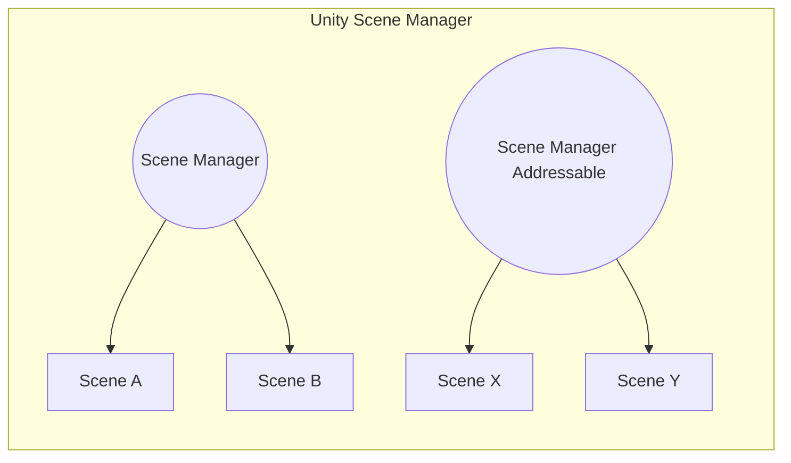

[](https://openupm.com/packages/com.mygamedevtools.scene-loader/)


Scene Loading
===

_A package that standardizes scene loading operations between the Unity Scene Manager and Addressables, allowing multiple alternatives of awaiting such as Coroutines, Async or UniTask._

Summary
---

* [Installation](#installation)
  * [OpenUPM](#openupm)
  * [Installing from Git](#installing-from-git-requires-git-installed-and-added-to-the-path)
* [Dependencies](#dependencies)
* [Overview](#overview)
* [Usage](#usage)
  * [The Scene Managers](#the-scene-managers)
  * [The LoadSceneInfo objects](#the-loadsceneinfo-objects)
  * [The Scene Loaders](#the-scene-loaders)
  * [Practical examples](#practical-examples)
    * [Creating your scene loader](#creating-your-scene-loader)
    * [Loading scenes with load scene info](#loading-scenes-with-load-scene-info)
      * [Standard Scene Manager](#standard-scene-manager)
      * [Addressable Scene Manager](#addressable-scene-manager)
  * [Why so many interfaces?](#why-so-many-interfaces)
* [Tests](#tests)
* [Samples](#samples)
  * [For standard scene management](#for-standard-scene-management)
  * [For Addressable scene management](#for-addressable-scene-management)

Installation
---

### OpenUPM

This package is available on the [OpenUPM](https://openupm.com/packages/com.mygamedevtools.scene-loader) registry. Add the package via the [openupm-cli](https://github.com/openupm/openupm-cli):

```
openupm add com.mygamedevtools.scene-loader
```

### [Installing from Git](https://docs.unity3d.com/Manual/upm-ui-giturl.html) _(requires [Git](https://git-scm.com/) installed and added to the PATH)_

1. Open `Edit/Project Settings/Package Manager`.
2. Click <kbd>+</kbd>.
3. Select `Add package from git URL...`.
4. Paste `https://github.com/mygamedevtools/scene-loader.git` into url.
5. Click `Add`.

Dependencies
---

The package works without any dependencies, but it supports integration with some packages.
If you wish to use it with Addressables, UniTask or TextMeshPro, make sure you install the packages:

* `com.unity.addressables` >= 1.19.0
* `com.unity.textmeshpro` >= 2.2.0
* `com.cysharp.unitask`* >= 2.0.0

_*Installed via UPM or OpenUPM. Check the [package documentation](https://github.com/Cysharp/UniTask) for more details._

Overview
---

Loading scenes in Unity is very simple, mostly, but when you start to deal with other systems such as [Unity Addressables](https://docs.unity3d.com/Manual/com.unity.addressables.html), it can get a little messy. Also, there are some common scene load scenarios that you'd usually reimplement every project, like scene transitions.

In this package, you'll have the possibility to standardize the scene loading process between the standard **Unity Scene Manager** and **Addressables**, while still being able to choose how to await (if you want) the operations, be it Coroutines, standard Async (through ValueTasks) or [UniTask](https://github.com/Cysharp/UniTask).

Aside from the ordinary **Load** and **Unload** actions, the Scene Loading tools introduce the **Transition** as a new standard to control transitions between scenes with an optional intermediate "loading scene" in between.

:information_source: You don't need to understand what **Addressables** or **UniTask** do in order to use this package. There are scene loaders that only rely on basic Unity Engine functionalities.

Usage
---

Loading scenes with this package implies that the scenes **will always be loaded as Additive**. That is simply because there is no advantage in loading scenes in the **Single** load scene mode when you expect to work with multiple scenes. 

In order to standardize how the scenes are loaded, you'll be using `ISceneLoader`, `ISceneManager` and `ILoadSceneInfo` objects.

### The Scene Managers

The `ISceneManager` interface exposes a few methods and events to standardize the scene load operations:

```cs
public interface ISceneManager
{
  event Action<Scene, Scene> ActiveSceneChanged;
  event Action<Scene> SceneUnloaded;
  event Action<Scene> SceneLoaded;

  int SceneCount { get; }

  void SetActiveScene(Scene scene);

  ValueTask<Scene> LoadSceneAsync(ILoadSceneInfo sceneInfo, bool setActive = false, IProgress<float> progress = null);

  ValueTask<Scene> UnloadSceneAsync(ILoadSceneInfo sceneInfo);

  Scene GetActiveScene();

  Scene GetLoadedSceneAt(int index);

  Scene GetLastLoadedScene();

  Scene GetLoadedSceneByName(string name);
}
```

You can find many similarities between Unity's [SceneManager](https://docs.unity3d.com/ScriptReference/SceneManagement.SceneManager.html) class, and that's both for maintaining an easy learning curve as well as because some of these operations will end up calling the _Unity Scene Manager_ internally (like `SetActiveScene` for instance).
There's also the `ILoadSceneInfo` interface showing up there, but we will get to that in a moment.

The package includes **two** scene managers:
* The `SceneManager`, for standard scene loading.
* The `SceneManagerAddressable`, for addressable scene loading.

You can also use their implementation as a reference to **build your own** Scene Manager.

Note that, scenes loaded by a scene manager are in a **local scope**, which means that if you plan to work with multiple scene managers, they will not be aware of the others' scenes.
In this context, the _Unity Scene Manager_ would be something like a **global scope scene manager**, since it's aware of every scene loaded in runtime.

Speaking of multiple scene managers, you can use a `SceneManager` and a `SceneManagerAddressable` **at the same time**, just keep in mind they will have their own contexts **in isolation** to the other.



The `ISceneManager` interface defines that both `LoadSceneAsync` and `UnloadSceneAsync` methods return a `ValueTask<Scene>`.
This means you can _await_ those methods if they are implemented with the _async_ keyword, or you can also subscribe to the `SceneLoaded` or `SceneUnloaded` events to receive the same `Scene` you would via the _async_ methods.

Both these methods also receive an `ILoadSceneInfo` object.
So, instead of having multiple methods for receiving the scene's build index or the scene's name, we simply have an object instead.

### The LoadSceneInfo objects

As its name states, these objects hold references to a scene to be loaded (or unloaded) and are able to validate whether they are a reference to a loaded scene.

The `ILoadSceneInfo` interface simply defines:

```cs
public interface ILoadSceneInfo
{
  object Reference { get; }

  bool IsReferenceToScene(Scene scene);
}
```

Since the `Reference` field is able to hold any type of reference, the scene manager will be responsible to decide what to do with its value.
The load scene info objects simply hold these references, and that's why the implementations included with the package are all **structs**.

You can choose to work with **four** load scene infos:

* The `LoadSceneInfoName`, that in standard scene manager is a reference to the scene name, and in the addressable scene manager, is a reference to its address.
* The `LoadSceneInfoIndex`, that only works in the standard scene manager, since the build index is not an addressable information.
* The `LoadSceneInfoScene`, that actually holds a reference to a scene, and can be used to unload specific scenes (useful if you have multiple scenes loaded with the same name, for example).
* The `LoadSceneInfoAssetReference`, that only works in the addressable scene manager.

You can also build your own `ILoadSceneInfo` implementation if have special needs, but that will probably require you to build a scene manager to interpret its `Reference` value as well.

### The Scene Loaders

The scene loaders are meant to be the interface that you will use to load scenes in your game, as they work like a wrapper layer to the scene managers, but adding the **Scene Transition** operation.
There are two interfaces for them, the base one with a reference to the `ISceneManager` that will be used, and an async interface, to be able to _await_ the load operations.

The `ISceneLoader` interface defines:

```cs
public interface ISceneLoader
{
  ISceneManager Manager { get; }

  void TransitionToScene(ILoadSceneInfo targetSceneInfo, ILoadSceneInfo intermediateSceneInfo = default);

  void UnloadScene(ILoadSceneInfo sceneInfo);

  void LoadScene(ILoadSceneInfo sceneInfo, bool setActive = false);
}
```

And the `ISceneLoaderAsync`:

```cs
public interface ISceneLoaderAsync<TAsync> : ISceneLoader
{
  TAsync TransitionToSceneAsync(ILoadSceneInfo targetSceneReference, ILoadSceneInfo intermediateSceneReference = default);

  TAsync LoadSceneAsync(ILoadSceneInfo sceneReference, bool setActive = false, IProgress<float> progress = null);

  TAsync UnloadSceneAsync(ILoadSceneInfo sceneReference);
}
```

Note that the `ISceneLoaderAsync` interface inherits from `ISceneLoader`.
The `TAsync` type should return a `Scene` instance, and can be anything you mean to _await_ or a [Coroutine](https://docs.unity3d.com/Manual/Coroutines.html) (that can't return anything without additional code), for example `Task<Scene>`, `ValueTask<Scene>` or `UniTask<Scene>`.

The `Manager` property can be used to listen to the `SceneLoaded`, `SceneUnloaded`, and `ActiveSceneChanged` events.
Both `LoadSceneAsync` and `UnloadSceneAsync` methods will simply call the `ISceneManager` equivalents, while the `LoadScene` and `UnloadScene` will do the same but without _await_.
It's important to understand that `LoadScene`, `UnloadScene` and `TransitionToScene` will still invoke asynchronous operations, instead of blocking the execution until they are done.
You can use the `ISceneManager` events to react to the completion of those methods.

The **Transition** is a combination of load and unload operations to effectively perform scene transitions, with or without an intermediate scene. For example, usually, if you'd want to go from scene A to scene B you would:

1. Load the scene B.
2. Unload the scene A.

That's only two operations right?
What if you wanted to have a loading screen as well?
In this case you would:

1. Load the loading scene.
2. Load the scene B.
4. Unload the scene A.
3. Unload the loading scene.

That's four operations now.
The `TransitionToScene` and `TransitionToSceneAsync` methods let you only provide where you want to go from the currently active scene and if you want an intermediary scene (loading scene for example).

### Practical Examples

When creating your scene loader, you must first create your scene manager.
Ideally, you will not need to store the scene manager anywhere as it will be accessible through the `ISceneLoader` interface.
Also, you will also need to build your scene info objects to hold references to scenes.

#### Creating your scene loader

For the first example, let's build a standard scene manager and a Coroutine scene loader:

```cs
// Make sure to add 'using MyGameDevTools.SceneLoading;' on the top of the script
ISceneManager sceneManager = new SceneManager();
ISceneLoader sceneLoader = new SceneLoaderCoroutine(sceneManager);
```

The scene loaders are able to receive any type of `ISceneManager`, for example:

```cs
ISceneManager standardSceneManager = new SceneManager();
ISceneLoader coroutineSceneLoader = new SceneLoaderCoroutine(standardSceneManager);

ISceneManager addressableSceneManager = new SceneManagerAddressable();
ISceneLoader asyncSceneLoader = new SceneLoaderAsync(addressableSceneLoader);
```

You can also define the scene loader types as their `ISceneLoaderAsync` implementations:

```cs
ISceneManager sceneManager = new SceneManager();

ISceneLoaderAsync<Coroutine> coroutineSceneLoader = new SceneLoaderCoroutine(sceneManager);
// Or
ISceneLoaderAsync<ValueTask<Scene>> asyncSceneLoader = new SceneLoaderAsync(sceneManager);
// Or
ISceneLoaderAsync<UniTask<Scene>> unitaskSceneLoader = new SceneLoaderUniTask(sceneManager);
```

#### Loading scenes with load scene info

You'll use the load scene info objects to reference scenes.
This can lead to differences when using the standard scene manager or the addressable scene manager.

##### Standard Scene Manager

Let's assume you have included the following scenes in your Build Settings:

0. Main Menu
1. Loading
2. Stage 1

You can load the scenes by their name or the build index:

```cs
ILoadSceneInfo mainMenuSceneInfo = new LoadSceneInfoName("Main Menu");
ILoadSceneInfo loadingSceneInfo = new LoadSceneInfoIndex(1);
ILoadSceneInfo stageSceneInfo = new LoadSceneInfoName("Stage 1");

sceneLoader.LoadScene(mainMenuSceneInfo);
sceneLoader.LoadScene(loadingSceneInfo);
sceneLoader.LoadScene(stageSceneInfo);

// Or the async alternatives
await sceneLoader.LoadSceneAsync(mainMenuSceneInfo);
await sceneLoader.LoadSceneAsync(loadingSceneInfo);
await sceneLoader.LoadSceneAsync(stageSceneInfo);
```

For unloading, you can do the same, or you can use the scene reference returned during the `LoadSceneAsync`:

```cs
ILoadSceneInfo mainMenuSceneInfo = new LoadSceneInfoName("Main Menu");
ILoadSceneInfo loadingSceneInfo = new LoadSceneInfoIndex(1);

Scene stageScene = await sceneLoader.LoadSceneAsync(new LoadSceneInfoName("Stage 1"));
ILoadSceneInfo stageSceneInfo = new LoadSceneInfoScene(stageScene);

sceneLoader.UnloadScene(mainMenuSceneInfo);
sceneLoader.UnloadScene(loadingSceneInfo);
sceneLoader.UnloadScene(stageSceneInfo);

// Or the async alternatives
await sceneLoader.UnloadSceneAsync(mainMenuSceneInfo);
await sceneLoader.UnloadSceneAsync(loadingSceneInfo);
await sceneLoader.UnloadSceneAsync(stageSceneInfo);
```

Instead of using the async method, you can also register to the `ISceneManager.SceneLoaded` event:

```cs
sceneLoader.Manager.SceneLoaded += loadedScene => 
{
  ILoadSceneInfo loadedSceneInfo = new LoadSceneInfoScene(loadedScene);
  sceneLoader.UnloadScene(loadedSceneInfo);
}
```

Finally, you can combine different load scene info objects on the transition method:

```cs
ILoadSceneInfo stageSceneInfo = new LoadSceneInfoName("Stage 1");
ILoadSceneInfo loadingSceneInfo = new LoadSceneInfoIndex(1);

sceneLoader.TransitionToScene(stageSceneInfo, loadingSceneInfo);

// Or the async alternative
await sceneLoader.TransitionToSceneAsync(stageSceneInfo, loadingSceneInfo);
```

##### Addressable Scene Manager

Let's assume you have the following addressable scenes with their own names as their address:

* Main Menu
* Loading
* Stage 1

You can load the scenes by their addresses or by an [AssetReference](https://docs.unity3d.com/Packages/com.unity.addressables@1.21/manual/AssetReferences.html) (usually exposed via [MonoBehaviours](https://docs.unity3d.com/ScriptReference/MonoBehaviour.html)):

```cs
ILoadSceneInfo mainMenuSceneInfo = new LoadSceneInfoName("Main Menu");
ILoadSceneInfo loadingSceneInfo = new LoadSceneInfoName("Loading");
ILoadSceneInfo stageSceneInfo = new LoadSceneInfoName("Stage 1");

sceneLoader.LoadScene(mainMenuSceneInfo);
sceneLoader.LoadScene(loadingSceneInfo);
sceneLoader.LoadScene(stageSceneInfo);

// Or the async alternatives
await sceneLoader.LoadSceneAsync(mainMenuSceneInfo);
await sceneLoader.LoadSceneAsync(loadingSceneInfo);
await sceneLoader.LoadSceneAsync(stageSceneInfo);
```

You cannot create `AssetReference` objects from code, unless you're in an editor context.
So the best way to use an `AssetReference` is to use a [MonoBehaviour](https://docs.unity3d.com/ScriptReference/MonoBehaviour.html) or a [ScriptableObject](https://docs.unity3d.com/ScriptReference/ScriptableObject.html), for example:

```cs
public class MyBehavior : MonoBehaviour
{
  [SerializeField]
  AssetReference _loadingScene;

  // [...]

  void LoadScene()
  {
    ILoadSceneInfo loadingSceneInfo = new LoadSceneInfoAssetReference(_loadingScene);
    sceneLoader.LoadScene(loadingSceneInfo);
  }
}
```

Same as the standard scene manager, you can unload scenes with the `Scene` reference as well:

```cs
ILoadSceneInfo mainMenuSceneInfo = new LoadSceneInfoName("Main Menu");
ILoadSceneInfo loadingSceneInfo = new LoadSceneInfoAssetReference(_loadingSceneReference);

Scene stageScene = await sceneLoader.LoadSceneAsync(new LoadSceneInfoName("Stage 1"));
ILoadSceneInfo stageSceneInfo = new LoadSceneInfoScene(stageScene);

sceneLoader.UnloadScene(mainMenuSceneInfo);
sceneLoader.UnloadScene(loadingSceneInfo);
sceneLoader.UnloadScene(stageSceneInfo);

// Or the async alternatives
await sceneLoader.UnloadSceneAsync(mainMenuSceneInfo);
await sceneLoader.UnloadSceneAsync(loadingSceneInfo);
await sceneLoader.UnloadSceneAsync(stageSceneInfo);
```

The `ISceneManager.SceneLoaded` event subscription also works exactly the same as the standard scene manager:

```cs
sceneLoader.Manager.SceneLoaded += loadedScene => 
{
  ILoadSceneInfo loadedSceneInfo = new LoadSceneInfoScene(loadedScene);
  sceneLoader.UnloadScene(loadedSceneInfo);
}
```

And you can also combine different load scene info objects on the transition method:

```cs
ILoadSceneInfo stageSceneInfo = new LoadSceneInfoName("Stage 1");
ILoadSceneInfo loadingSceneInfo = new LoadSceneInfoAssetReference(_loadingSceneReference);

sceneLoader.TransitionToScene(stageSceneInfo, loadingSceneInfo);

// Or the async alternative
await sceneLoader.TransitionToSceneAsync(stageSceneInfo, loadingSceneInfo);
```

### Why so many interfaces?

The idea behind the interfaces is first to decouple things and second to allow you to build your own systems if you require something very different from the provided content.
Sometimes projects require very specific implementations, and instead of making the system extremely complex and detailed, I'd rather have it broken into many different pieces that you can replace to fit with whatever works best in each use case.

I am always open to suggestions, so please if you have any, don't hesistate to share!

Tests
---

This package includes tests to assert most use cases of the Scene Managers and Scene Loaders.
The tests do not have any effect on a runtime build of the game, they only mean to work in a development environment.

Samples
---

This package offers samples with each of the scene loaders for you to use as a starting point. To use them, simply import the desired sample through the Package Manager.

### For standard scene management:

Make sure you add all scenes to the build settings with the following indexes:

0. SceneA
1. SceneB
2. SceneLoading
3. SceneC_add
4. SceneD_add

You can try out the sample by loading either the SceneA or SceneB and hitting play in the Unity Editor.

### For Addressable scene management:

Make sure you mark all scenes as addressables and simplify their names in the Addressable Groups window. To test, open up the **Bootstrap** scene and hit play.

Check if your Addressables Play Mode Script is `Use Asset Database`, otherwise you may be required to build the Addressable groups.

---

Don't hesitate to create [issues](https://github.com/mygamedevtools/scene-loader/issues) for suggestions and bugs. Have fun!

[Back to top](#scene-loader)