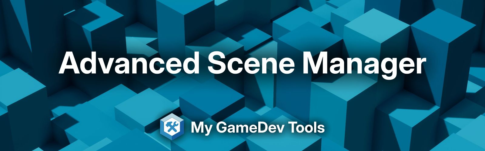

<p align="center">
  
</p>

<p align=center>
  <a href=""></a>
  <a href="LICENSE"></a>
  <a href="https://github.com/mygamedevtools/scene-loader/releases/latest"></a>
  <a href="https://openupm.com/packages/com.mygamedevtools.scene-loader/"></a>
  <a href="https://openupm.com/packages/com.mygamedevtools.scene-loader/"></a>
</p>

<p align=center>
  <a href="https://codecov.io/github/mygamedevtools/scene-loader"></a>
  <a href="https://github.com/mygamedevtools/scene-loader/actions/workflows/test.yml"></a>
  <a href="https://github.com/mygamedevtools/scene-loader/actions/workflows/release.yml"></a>
  <a href="https://github.com/semantic-release/semantic-release"></a>
</p>

## ⚡ Overview

**My Scene Manager** is a Unity package to **simplify** scene operations: **load**, **unload** and **transition**. In a quick example:

```cs
MySceneManager.TransitionAsync("my-target-scene", "my-loading-scene");
```

Instead of:

```cs
yield return SceneManager.LoadSceneAsync("my-loading-scene", LoadSceneMode.Additive);
yield return SceneManager.LoadSceneAsync("my-target-scene", LoadSceneMode.Additive);
SceneManager.SetActiveScene(SceneManager.GetSceneByName("my-target-scene"));
SceneManager.UnloadSceneAsync("my-loading-scene");
SceneManager.UnloadSceneAsync("my-previous-scene");
```

## 🚀 Features

- **Seamless Scene Transitions**: Transition between scenes with ease, with optional loading scenes for a smooth user experience.
- **Addressable and Non-Addressable Scene Support**: Manage both addressable and non-addressable scenes through a unified API.
- **Async/Await Support**: Fully compatible with _async/await_ for smooth, non-blocking scene operations.
- **Loading Screens**: Easily build loading screens with built-in components.
- **Modular Design** — Use only the components you need, fully customizable.

## 📦 Installation

You can install the package via **[OpenUPM](https://openupm.com/packages/com.mygamedevtools.scene-loader)**, **Git** or **Tarball**.
Check the full installation guide in the [documentation](https://mygamedevtools.com/scene-loader/docs/next/getting-started/installation).

#### OpenUPM

* Open `Edit/Project Settings/Package Manager`.
* Add a new **Scoped Registry** (or edit the existing _OpenUPM_ entry):
    ```
    Name: Open UPM
    URL: https://package.openupm.com
    Scope(s): com.mygamedevtools
    ```
* Click `Apply`.
* Open `Window/Package Manager`.
* In the left column, select `Open UPM` inside `My Registries`.
* Select `Advanced Scene Manager` under `My GameDev Tools`.
* Click `Install`.

#### Git

1. Open `Window/Package Manager`.
2. Click <kbd>+</kbd>.
3. Select `Install package from git URL...`.
4. Paste `https://github.com/mygamedevtools/scene-loader.git#upm` into url.
5. Click `Add`.

#### Tarball

1. Choose the [release](https://github.com/mygamedevtools/scene-loader/releases) you want to install and download the `com.mygamedevtools.scene-loader-<release>.tgz` asset.
2. Open `Window/Package Manager`.
3. Click <kbd>+</kbd>.
4. Select `Install package from tarball...`.
5. Select the `com.mygamedevtools.scene-loader-<release>.tgz` file you downloaded.

## 📚 Documentation

The detailed documentation including usage guides, examples, update guides, and tutorials are available in the [official documentation](https://mygamedevtools.com/scene-loader/).

## 🤝 Contributing

We welcome contributions! Please check our [contribution guidelines](./CONTRIBUTING.md).

## 📄 License

This project is licensed under the [MIT License](./LICENSE).