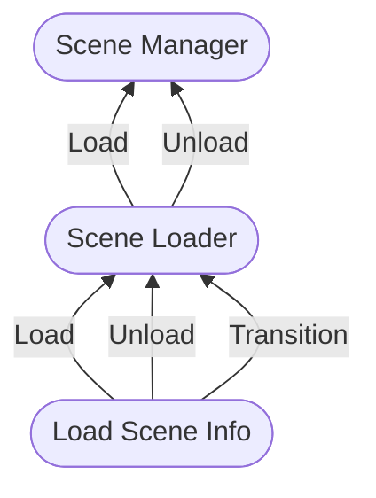
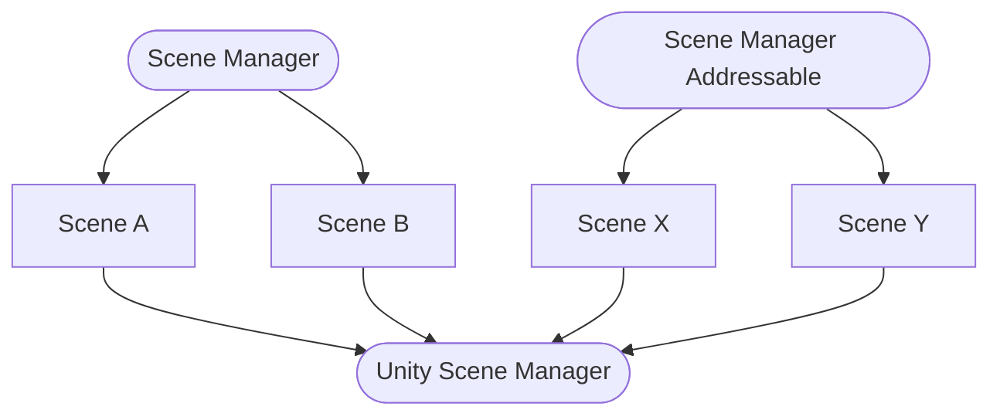

<h1 align=center>
Scene Loading
</h1>

<p align=center>
  <a href="LICENSE"></a>
  <a href="https://github.com/mygamedevtools/scene-loader/releases/latest"></a>
  <a href="https://openupm.com/packages/com.mygamedevtools.scene-loader/"></a>
  <a href="https://openupm.com/packages/com.mygamedevtools.scene-loader/"></a>
</p>

<p align=center>  
  <a href="https://codecov.io/github/mygamedevtools/scene-loader"></a>
  <a href="https://github.com/mygamedevtools/scene-loader/actions/workflows/test.yml"></a>
  <a href="https://github.com/mygamedevtools/scene-loader/actions/workflows/release.yml"></a>
  <a href="https://github.com/semantic-release/semantic-release"></a>
</p>

<p align=center><i>
A package that standardizes scene loading operations between the Unity Scene Manager and Addressables, allowing multiple awaiting alternatives such as Coroutines, Async, or UniTask; and adds support for batch scene operations.
</i></p>

Summary
---

* [Installation](#installation)
  * [OpenUPM](#openupm)
  * [Installing from Git](#installing-from-git-requires-git-installed-and-added-to-the-path)
* [Dependencies](#dependencies)
* [Overview](#overview)
  * [TL;DR](#tldr)
  * [Description](#description)
* [Usage](#usage)
  * [The Scene Managers](#the-scene-managers)
  * [The LoadSceneInfo objects](#the-loadsceneinfo-objects)
  * [The Scene Loaders](#the-scene-loaders)
  * [Disposable and CancellationTokens](#disposable-and-cancellationtokens)
  * [Practical examples](#practical-examples)
    * [Creating your scene loader](#creating-your-scene-loader)
    * [Loading scenes with load scene info](#loading-scenes-with-load-scene-info)
      * [Standard Scene Manager](#standard-scene-manager)
      * [Addressable Scene Manager](#addressable-scene-manager)
  * [Creating Loading Screens](#creating-loading-screens)
    * [The Loading Behavior](#the-loading-behavior)
    * [The Loading States](#the-loading-states)
    * [The Loading Feedbacks](#the-loading-feedbacks)
    * [Loading Screen Example](#loading-screen-example)
  * [Why so many interfaces?](#why-so-many-interfaces)
* [Tests](#tests)

Installation
---

### OpenUPM

This package is available on the [OpenUPM](https://openupm.com/packages/com.mygamedevtools.scene-loader) registry. Add the package via the [openupm-cli](https://github.com/openupm/openupm-cli):

```
openupm add com.mygamedevtools.scene-loader
```

### [Installing from Git](https://docs.unity3d.com/Manual/upm-ui-giturl.html) _(requires [Git](https://git-scm.com/) installed and added to the PATH)_

1. Open `Edit/Project Settings/Package Manager`.
2. Click <kbd>+</kbd>.
3. Select `Add package from git URL...`.
4. Paste `https://github.com/mygamedevtools/scene-loader.git#upm` into url.
5. Click `Add`.

Dependencies
---

The package works without any dependencies but supports integration with some packages.
If you wish to use it with Addressables, UniTask, or TextMeshPro, make sure you install the packages:

* `com.unity.addressables` >= 1.19.0
* `com.unity.textmeshpro` >= 2.2.0
* `com.cysharp.unitask`* >= 2.0.0

_*Installed via UPM or OpenUPM. Check the [package documentation](https://github.com/Cysharp/UniTask) for more details._

Overview
---

### TL;DR

* Simplify scene loading with [Unity Addressables](https://docs.unity3d.com/Manual/com.unity.addressables.html) or standard Unity Scenes.
* Ability to **transition** between scenes.
* Batch scene operations: load, unload, or transition to **multiple scenes**.

### Description

Loading scenes in Unity is very simple, mostly, but when you start to deal with other systems such as [Unity Addressables](https://docs.unity3d.com/Manual/com.unity.addressables.html), it can get a little messy. Also, there are some common scene load scenarios that you'd usually reimplement in every project, like scene transitions.

In this package, you'll have the possibility to standardize the scene loading process between the standard **Unity Scene Manager** and **Addressables**, while still being able to choose how to await (if you want) the operations, be it Coroutines, standard Async (through ValueTasks) or [UniTask](https://github.com/Cysharp/UniTask).

Aside from the ordinary **Load** and **Unload** actions, the Scene Loading tools introduce the **Transition** as a new standard to control transitions between scenes with an optional intermediate "loading scene" in between. Also, starting from version `2.2` you can **Load**, **Unload**, and **Transition** to **multiple scenes** in parallel!

> [!NOTE]
> You don't need to understand what **Addressables** or **UniTask** do to use this package. There are scene loaders that only rely on basic Unity Engine functionalities.

Usage
---

Loading scenes with this package implies that the scenes **will always be loaded as Additive**. That is simply because there is no advantage in loading scenes in the **Single** load scene mode when you expect to work with multiple scenes. 

To standardize how the scenes are loaded, you'll be using `ISceneLoader`, `ISceneManager`, and `ILoadSceneInfo` objects.



These structures are meant to be used together. If you do not plan to use scene transitions or to have custom _awaitable_ types, you don't need to use the `ISceneLoader`.

### The Scene Managers

The `ISceneManager` interface exposes a few methods and events to standardize the scene load operations:

```cs
public interface ISceneManager : IDisposable
{
  event Action<Scene, Scene> ActiveSceneChanged;
  event Action<Scene> SceneUnloaded;
  event Action<Scene> SceneLoaded;

  int SceneCount { get; }

  void SetActiveScene(Scene scene);

  ValueTask<Scene[]> LoadScenesAsync(ILoadSceneInfo[] sceneInfos, int setIndexActive = -1, IProgress<float> progress = null, CancellationToken token = default);

  ValueTask<Scene> LoadSceneAsync(ILoadSceneInfo sceneInfo, bool setActive = false, IProgress<float> progress = null, CancellationToken token = default);

  ValueTask<Scene[]> UnloadSceneAsync(ILoadSceneInfo[] sceneInfos, CancellationToken token = default);

  ValueTask<Scene> UnloadSceneAsync(ILoadSceneInfo sceneInfo, CancellationToken token = default);

  Scene GetActiveScene();

  Scene GetLoadedSceneAt(int index);

  Scene GetLastLoadedScene();

  Scene GetLoadedSceneByName(string name);
}
```

You can find many similarities between Unity's [SceneManager](https://docs.unity3d.com/ScriptReference/SceneManagement.SceneManager.html) class, and that's both for maintaining an easy learning curve as well as because some of these operations will end up calling the _Unity Scene Manager_ internally (like `SetActiveScene` for instance).
The `ILoadSceneInfo` interface is also showing up there, but we will get to that in a moment.

The package includes **two** scene managers:
* The `SceneManager`, for standard scene loading.
* The `SceneManagerAddressable`, for addressable scene loading.

You can also use their implementation as a reference to **build your own** Scene Manager.

Note that, scenes loaded by a scene manager are in a **local scope**, which means that if you plan to work with multiple scene managers, they will not be aware of the others' scenes.
In this context, the _Unity Scene Manager_ would be something like a **global scope scene manager**, since it's aware of every scene loaded in runtime.

Speaking of multiple scene managers, you can use a `SceneManager` and a `SceneManagerAddressable` **at the same time**, just keep in mind they will have their contexts **in isolation** to the other.



The `ISceneManager` interface defines that both `LoadSceneAsync` and `UnloadSceneAsync` methods return a `ValueTask<Scene>`.
This means you can _await_ those methods if they are implemented with the _async_ keyword, or you can also subscribe to the `SceneLoaded` or `SceneUnloaded` events to receive the same `Scene` you would via the _async_ methods.

Both these methods also receive an `ILoadSceneInfo` object.
So, instead of having multiple methods for receiving the scene's build index or the scene's name, we simply have an object instead.

Alternatively, you can also use the `LoadScenesAsync` and `UnloadScenesAsync` methods, to perform the operations on multiple scenes in parallel. These will return a `ValueTask<Scene[]>`.

### The LoadSceneInfo objects

As its name states, these objects hold references to a scene to be loaded (or unloaded) and can validate whether they are a reference to a loaded scene.

The `ILoadSceneInfo` interface simply defines:

```cs
public interface ILoadSceneInfo
{
  object Reference { get; }

  bool IsReferenceToScene(Scene scene);
}
```

Since the `Reference` field can hold any type of reference, the scene manager will be responsible for deciding what to do with its value.
The load scene info objects simply hold these references, and that's why the implementations included with the package are all **structs**.

You can choose to work with **four** load scene infos:

* The `LoadSceneInfoName`, in the standard scene manager is a reference to the scene name, and in the addressable scene manager, is a reference to its address.
* The `LoadSceneInfoIndex`, that only works in the standard scene manager, since the build index is not addressable information.
* The `LoadSceneInfoScene`, which holds a reference to a scene, and can be used to unload specific scenes (useful if you have multiple scenes loaded with the same name, for example).
* The `LoadSceneInfoAssetReference`, that only works in the addressable scene manager.

You can also build your own `ILoadSceneInfo` implementation if have special needs, but that will probably require you to build a scene manager to interpret its `Reference` value as well.

### The Scene Loaders

The scene loaders are meant to be the interface that you will use to load scenes in your game, as they work like a wrapper layer to the scene managers, but add the **Scene Transition** operation.
There are two interfaces for them, the base one with a reference to the `ISceneManager` that will be used, and an async interface, to be able to _await_ the load operations.

The `ISceneLoader` interface defines:

```cs
public interface ISceneLoader : IDisposable
{
  ISceneManager Manager { get; }

  void TransitionToScenes(ILoadSceneInfo[] targetScenes, int setIndexActive, ILoadSceneInfo intermediateSceneInfo = null, Scene externalOriginScene = default);

  void TransitionToScene(ILoadSceneInfo targetSceneInfo, ILoadSceneInfo intermediateSceneInfo = null, Scene externalOriginScene = default);

  void UnloadScenes(ILoadSceneInfo[] sceneInfos);

  void UnloadScene(ILoadSceneInfo sceneInfo);

  void LoadScenes(ILoadSceneInfo[] sceneInfos, int setIndexActive = -1);

  void LoadScene(ILoadSceneInfo sceneInfo, bool setActive = false);
}
```

And the `ISceneLoaderAsync`:

```cs
public interface ISceneLoaderAsync<TAsyncScene, TAsyncSceneArray> : ISceneLoader
{
  TAsyncSceneArray TransitionToScenesAsync(ILoadSceneInfo[] targetScenes, int setIndexActive, ILoadSceneInfo intermediateSceneReference = default, Scene externalOriginScene = default, CancellationToken token = default);
  
  TAsyncScene TransitionToSceneAsync(ILoadSceneInfo targetSceneReference, ILoadSceneInfo intermediateSceneReference = default, Scene externalOriginScene = default, CancellationToken token = default);

  TAsyncSceneArray LoadScenesAsync(ILoadSceneInfo[] sceneReferences, int setIndexActive = -1, IProgress<float> progress = null, CancellationToken token = default);

  TAsyncScene LoadSceneAsync(ILoadSceneInfo sceneReference, bool setActive = false, IProgress<float> progress = null, CancellationToken token = default);

  TAsyncSceneArray UnloadScenesAsync(ILoadSceneInfo[] sceneReferences, CancellationToken token = default);

  TAsyncScene UnloadSceneAsync(ILoadSceneInfo sceneReference, CancellationToken token = default);
}
```

Note that the `ISceneLoaderAsync` interface inherits from `ISceneLoader`.
The `TAsyncScene` type should return a `Scene` instance, and can be anything you mean to _await_ or a [Coroutine](https://docs.unity3d.com/Manual/Coroutines.html) (that can't return anything without additional code), for example, `Task<Scene>`, `ValueTask<Scene>` or `UniTask<Scene>`, while the `TAsyncSceneArray` should return a `Scene[]` instance, such as `Task<Scene[]>`, `ValueTask<Scene[]>` or `UniTask<Scene[]>`.

The package comes with **three** Scene Loader implementations:
* The `SceneLoaderCoroutine`, simply returns `Coroutines` for every method.
* The `SceneLoaderAsync`, that just like the `ISceneManager` implementations, will return `ValueTask` values.
* The `SceneLoaderUniTask`, will return `UniTask` values.

All of them have interfaces to simplify your code:

```cs
public interface ISceneLoaderCoroutine : ISceneLoaderAsync<Coroutine, Coroutine> { }

public interface ISceneLoaderAsync : ISceneLoaderAsync<ValueTask<Scene>, ValueTask<Scene[]>> { }

public interface ISceneLoaderUniTask : ISceneLoaderAsync<UniTask<Scene>, UniTask<Scene[]>> { }
```

The `Manager` property can be used to listen to the `SceneLoaded`, `SceneUnloaded`, and `ActiveSceneChanged` events.
Both `LoadSceneAsync` and `UnloadSceneAsync` methods will simply call the `ISceneManager` equivalents, while the `LoadScene` and `UnloadScene` will do the same but without _await_.
It's important to understand that `LoadScene`, `UnloadScene`, and `TransitionToScene` will still invoke asynchronous operations, instead of blocking the execution until they are done.
You can use the `ISceneManager` events to react to the completion of those methods.

The **Transition** is a combination of load and unload operations to effectively perform scene transitions, with or without an intermediate scene. For example, usually, if you'd want to go from scene A to scene B you would:

1. Load the scene B.
2. Unload the scene A.

That's only two operations, right?
What if you wanted to have a loading screen as well?
In this case, you would:

1. Load the loading scene.
2. Load the scene B.
4. Unload the scene A.
3. Unload the loading scene.

That's four operations now.
The `TransitionToScene` and `TransitionToSceneAsync` methods let you only provide where you want to go from the currently active scene and if you want an intermediary scene (loading scene for example).

You can also transition from a scene **outside** of the scene manager context, by providing a scene in the `externalOriginScene` parameter in the Transition methods. Just make sure this scene **is not** in another scene manager context.

### Disposable and CancellationTokens

Both the `ISceneManager` and the `ISceneLoader` interfaces implement `IDisposable`, meaning that the Scene Managers and Loaders should implement the `Dispose()` method.
This is used with the `CancellationToken` parameters in `ISceneManager` methods to ensure that it will clear its internal data and stop async code execution during disposal.
Note that even when its methods get canceled by the `CancellationToken`, the Unity Scene Manager methods are not cancellable and therefore will continue to operate when called.

The disposal of the implemented Scene Managers will clear its data and stop any running logic.
This is useful for shutting down the application, for example.
In this context, the Unity Scene Manager has its internal logic to stop itself.
In other contexts, the Unity Scene Manager operations may continue to run after the `ISceneManager` is disposed.

If you are going to manually dispose of your scene loaders or managers, prefer the following scenarios:
* You can ensure that there are no load/unload/transition operations in progress.
* You are quitting/shutting down the application or an application module.

> [!WARNING]
> It's **not recommended** to manually cancel the `ISceneManager` operations via its `CancellationToken` parameters.
> It may result in unexpected issues such as unwanted scenes being loaded/unloaded after cancellation.

### Practical Examples

When creating your scene loader, you must first create your scene manager.
Ideally, you will not need to store the scene manager anywhere as it will be accessible through the `ISceneLoader` interface.
Also, you will need to build your scene info objects to hold references to scenes.

#### Creating your scene loader

For the first example, let's build a standard scene manager and a Coroutine scene loader:

```cs
// Make sure to add 'using MyGameDevTools.SceneLoading;' on the top of the script
ISceneManager sceneManager = new SceneManager();
ISceneLoader sceneLoader = new SceneLoaderCoroutine(sceneManager);
```

The scene loaders can receive any type of `ISceneManager`, for example:

```cs
ISceneManager standardSceneManager = new SceneManager();
ISceneLoader coroutineSceneLoader = new SceneLoaderCoroutine(standardSceneManager);

ISceneManager addressableSceneManager = new SceneManagerAddressable();
ISceneLoader asyncSceneLoader = new SceneLoaderAsync(addressableSceneLoader);
```

You can also define the scene loader types as their `ISceneLoaderAsync` implementations:

```cs
ISceneManager sceneManager = new SceneManager();

ISceneLoaderCoroutine coroutineSceneLoader = new SceneLoaderCoroutine(sceneManager);
// Or
ISceneLoaderAsync asyncSceneLoader = new SceneLoaderAsync(sceneManager);
// Or
ISceneLoaderUniTask unitaskSceneLoader = new SceneLoaderUniTask(sceneManager);
```

#### Loading scenes with load scene info

You'll use the load scene info objects to reference scenes.
This can lead to differences when using the standard scene manager or the addressable scene manager.

##### Standard Scene Manager

Let's assume you have included the following scenes in your Build Settings:

0. Main Menu
1. Loading
2. Stage 1

You can load the scenes by their name or the build index:

```cs
ILoadSceneInfo mainMenuSceneInfo = new LoadSceneInfoName("Main Menu");
ILoadSceneInfo loadingSceneInfo = new LoadSceneInfoIndex(1);
ILoadSceneInfo stageSceneInfo = new LoadSceneInfoName("Stage 1");

sceneLoader.LoadScene(mainMenuSceneInfo);
sceneLoader.LoadScene(loadingSceneInfo);
sceneLoader.LoadScene(stageSceneInfo);

// Or the async alternatives
await sceneLoader.LoadSceneAsync(mainMenuSceneInfo);
await sceneLoader.LoadSceneAsync(loadingSceneInfo);
await sceneLoader.LoadSceneAsync(stageSceneInfo);
```

For unloading, you can do the same, or you can use the scene reference returned during the `LoadSceneAsync`:

```cs
ILoadSceneInfo mainMenuSceneInfo = new LoadSceneInfoName("Main Menu");
ILoadSceneInfo loadingSceneInfo = new LoadSceneInfoIndex(1);

Scene stageScene = await sceneLoader.LoadSceneAsync(new LoadSceneInfoName("Stage 1"));
ILoadSceneInfo stageSceneInfo = new LoadSceneInfoScene(stageScene);

sceneLoader.UnloadScene(mainMenuSceneInfo);
sceneLoader.UnloadScene(loadingSceneInfo);
sceneLoader.UnloadScene(stageSceneInfo);

// Or the async alternatives
await sceneLoader.UnloadSceneAsync(mainMenuSceneInfo);
await sceneLoader.UnloadSceneAsync(loadingSceneInfo);
await sceneLoader.UnloadSceneAsync(stageSceneInfo);
```

Instead of using the async method, you can also register to the `ISceneManager.SceneLoaded` event:

```cs
sceneLoader.Manager.SceneLoaded += loadedScene => 
{
  ILoadSceneInfo loadedSceneInfo = new LoadSceneInfoScene(loadedScene);
  sceneLoader.UnloadScene(loadedSceneInfo);
}
```

Finally, you can combine different load scene info objects on the transition method:

```cs
ILoadSceneInfo stageSceneInfo = new LoadSceneInfoName("Stage 1");
ILoadSceneInfo loadingSceneInfo = new LoadSceneInfoIndex(1);

sceneLoader.TransitionToScene(stageSceneInfo, loadingSceneInfo);

// Or the async alternative
await sceneLoader.TransitionToSceneAsync(stageSceneInfo, loadingSceneInfo);
```

##### Addressable Scene Manager

Let's assume you have the following addressable scenes with their names as their address:

* Main Menu
* Loading
* Stage 1

You can load the scenes by their addresses or by an [AssetReference](https://docs.unity3d.com/Packages/com.unity.addressables@1.21/manual/AssetReferences.html) (usually exposed via [MonoBehaviours]):

```cs
ILoadSceneInfo mainMenuSceneInfo = new LoadSceneInfoName("Main Menu");
ILoadSceneInfo loadingSceneInfo = new LoadSceneInfoName("Loading");
ILoadSceneInfo stageSceneInfo = new LoadSceneInfoName("Stage 1");

sceneLoader.LoadScene(mainMenuSceneInfo);
sceneLoader.LoadScene(loadingSceneInfo);
sceneLoader.LoadScene(stageSceneInfo);

// Or the async alternatives
await sceneLoader.LoadSceneAsync(mainMenuSceneInfo);
await sceneLoader.LoadSceneAsync(loadingSceneInfo);
await sceneLoader.LoadSceneAsync(stageSceneInfo);
```

You cannot create `AssetReference` objects from code unless you're in an editor context.
So the best way to use an `AssetReference` is to use a [MonoBehaviour] or a [ScriptableObject], for example:

```cs
public class MyBehavior : MonoBehaviour
{
  [SerializeField]
  AssetReference _loadingScene;

  // [...]

  void LoadScene()
  {
    ILoadSceneInfo loadingSceneInfo = new LoadSceneInfoAssetReference(_loadingScene);
    sceneLoader.LoadScene(loadingSceneInfo);
  }
}
```

Same as the standard scene manager, you can unload scenes with the `Scene` reference as well:

```cs
ILoadSceneInfo mainMenuSceneInfo = new LoadSceneInfoName("Main Menu");
ILoadSceneInfo loadingSceneInfo = new LoadSceneInfoAssetReference(_loadingSceneReference);

Scene stageScene = await sceneLoader.LoadSceneAsync(new LoadSceneInfoName("Stage 1"));
ILoadSceneInfo stageSceneInfo = new LoadSceneInfoScene(stageScene);

sceneLoader.UnloadScene(mainMenuSceneInfo);
sceneLoader.UnloadScene(loadingSceneInfo);
sceneLoader.UnloadScene(stageSceneInfo);

// Or the async alternatives
await sceneLoader.UnloadSceneAsync(mainMenuSceneInfo);
await sceneLoader.UnloadSceneAsync(loadingSceneInfo);
await sceneLoader.UnloadSceneAsync(stageSceneInfo);
```

The `ISceneManager.SceneLoaded` event subscription also works the same as the standard scene manager:

```cs
sceneLoader.Manager.SceneLoaded += loadedScene => 
{
  ILoadSceneInfo loadedSceneInfo = new LoadSceneInfoScene(loadedScene);
  sceneLoader.UnloadScene(loadedSceneInfo);
}
```

And you can also combine different load scene info objects on the transition method:

```cs
ILoadSceneInfo stageSceneInfo = new LoadSceneInfoName("Stage 1");
ILoadSceneInfo loadingSceneInfo = new LoadSceneInfoAssetReference(_loadingSceneReference);

sceneLoader.TransitionToScene(stageSceneInfo, loadingSceneInfo);

// Or the async alternative
await sceneLoader.TransitionToSceneAsync(stageSceneInfo, loadingSceneInfo);
```

### Creating Loading Screens

During scene transitions, you have the option to provide an intermediate scene that will work just like a loading screen.
This could be an animated splash screen or a loading progress bar, for example.
This package provides implementations to help you build your loading screens faster.

#### The Loading Behavior

The Loading Behavior is a [MonoBehaviour] component, which you can attach to Unity [GameObjects], that receives the progress value from the scene manager.
You **need** to add a `LoadingBehavior` component to a [GameObject] in your loading scene to be able to display scene loading feedback.
It exposes its `LoadingProgress` instance, which you can use to listen to the loading events:

```cs
public class LoadingProgress : IProgress<float>
{
  public event LoadingStateChangeDelegate StateChanged;
  public event SceneLoadProgressDelegate Progressed;

  public LoadingState State { get; }
}
```

The `StateChanged` event expects a `LoadingState` parameter, to report the current state of the scene loading operation, and you can query the active state at any time by retrieving the value in the `State` property.
The `Progressed` event expects a `float` parameter, ranging from 0 to 1 to report the progress of the scene loading operation.

Back to the `LoadingBehavior`, it has a few options you can set on the Unity [Inspector](https://docs.unity3d.com/Manual/UsingTheInspector.html):

* **Wait For Scripted Start**: enable if the loading screen will have a **transition in** effect, such as a fade in.
* **Wait For Scripted End**: enable if the loading screen will have a **transition out** effect, such as a fade out.
* R**educed Load Ratio**: enable if you're working with standard scene loading operations _(non-addressable)_.

#### The Loading States

The loading scene transition can be customized to delay some parts of the operation to deliver a smooth visual experience for the user.
That means we can fade in/out or use other transition effects and wait for them to complete to continue the scene loading operations.
The `LoadingState` enum reflects those states:

```cs
public enum LoadingState
{
  WaitingToStart,
  Loading,
  TargetSceneLoaded,
  TransitionComplete
}
```

These states are ordered, which means that the first state will always be `WaitingToStart` and the last will be `TransitionComplete`.
They mean:

* `WaitingToStart`: it's waiting for a trigger to allow the scene loading to start loading. This could be if the loading scene does not instantly appear, otherwise causing weird experiences with things simply disappearing. You can transition the loading screen with a fade in or a similar effect, for example.
* `Loading`: the loading screen transition has occurred and the scene loading operation is running. During this state, the `LoadingProgress` instance will receive the progress value from the scene manager.
* `TargetSceneLoaded`: the target scene has been loaded, but the loading screen is still displaying. You can use this state to transition the loading screen out, such as a fade out or a similar effect.
* `TransitionComplete`: the target scene has been loaded and the loading screen is already out of the way. Shortly after this state, the loading scene will be unloaded.

#### The Loading Feedback

At this point, you should already have your loading scene with a `LoadingBehavior` attached to one of your [GameObjects].
Now you can also add some other components to display the loading progress feedback.
This package comes with **three** feedbacks:

* `LoadingFeedbackSlider`: attach on an [UI Slider] to display the loading progress feedback as a progress bar.
* `LoadingFeedbackTextMeshPro`: attach on an [UI Text Mesh Pro] to display the loading progress feedback as text normalized from 0 to 100.
* `LoadingFeedbackText` _(also known as Legacy)_: attach on an [UI Legacy Text](https://docs.unity3d.com/Packages/com.unity.ugui@1.0/manual/script-Text.html) to display the loading progress feedback as text normalized from 0 to 100.

You can use a combination of these feedback components in the loading scene.
Remember to assign the `LoadingBehavior` field of these components to the `LoadingBehavior` component you created before.

Another feedback that you could make is a **fade in/out** effect.
The `LoadingFader` component does just that.
Add it to an [UI CanvasGroup] [GameObject] to control the group's alpha value during the visual transitions.
You can also set the fade time and customize the fade in/out animation curves to suit your preference.

To use the `LoadingFader` effectively, you must **enable** both `WaitForScriptedStart` and `WaitForScriptedEnd` toggles in your `LoadingBehavior` component.

#### Loading Screen Example

Take the following loading screen scene hierarchy as an example:

* Canvas - ([Canvas](https://docs.unity3d.com/Packages/com.unity.ugui@1.0/manual/class-Canvas.html), [CanvasScaler](https://docs.unity3d.com/Packages/com.unity.ugui@1.0/manual/script-CanvasScaler.html), `LoadingBehavior`)
  * Group - ([CanvasGroup], `LoadingFader`)
    * Background - ([Image](https://docs.unity3d.com/Packages/com.unity.ugui@1.0/manual/script-Image.html))
    * Text_Message - ([TextMeshProUGUI])
    * Slider_Progress - ([Slider], `LoadingFeedbackSlider`)
      * Text_Progress - ([TextMeshProUGUI], `LoadingFeedbackTextMeshPro`)

By having this hierarchy in your loading scene, it would be able to fade in/out and display both the loading progress bar and loading progress text feedback.
As this scene has the `LoadingFader` component, remember to enable both `WaitForScriptedStart` and `WaitForScriptedEnd` toggles in the `LoadingBehavior` component.
Also, if you're not using an addressable scene manager, enable the `ReducedLoadRatio` toggle.

You can test this scene by passing its `ILoadSceneInfo` reference as the `intermediateSceneInfo` in an `ISceneLoader.TransitionToScene` method.

### Why so many interfaces?

The idea behind the interfaces is first to decouple things and second to allow you to build your systems if you require something very different from the provided content.
Sometimes projects require very specific implementations, and instead of making the system extremely complex and detailed, I'd rather have it broken into many different pieces that you can replace to fit with whatever works best in each use case.

I am always open to suggestions, so please if you have any, don't hesitate to share!

Tests
---

This package includes tests to assert most use cases of the Scene Managers and Scene Loaders.
The tests do not have any effect on a runtime build of the game, they only mean to work in a development environment.

---

Don't hesitate to create [issues](https://github.com/mygamedevtools/scene-loader/issues) for suggestions and bugs. Have fun!

[Back to top](#scene-loading)

[MonoBehaviour]: https://docs.unity3d.com/Manual/class-MonoBehaviour.html
[MonoBehaviours]: https://docs.unity3d.com/Manual/class-MonoBehaviour.html
[ScriptableObject]: https://docs.unity3d.com/Manual/class-ScriptableObject.html
[GameObject]: https://docs.unity3d.com/Manual/class-GameObject.html
[GameObjects]: https://docs.unity3d.com/Manual/class-GameObject.html
[UI Text Mesh Pro]: https://docs.unity3d.com/Packages/com.unity.textmeshpro@3.0/api/TMPro.TextMeshProUGUI.html
[TextMeshProUGUI]: https://docs.unity3d.com/Packages/com.unity.textmeshpro@3.0/api/TMPro.TextMeshProUGUI.html
[UI Slider]: https://docs.unity3d.com/Packages/com.unity.ugui@1.0/manual/script-Slider.html
[Slider]: https://docs.unity3d.com/Packages/com.unity.ugui@1.0/manual/script-Slider.html
[UI Canvas Group]: https://docs.unity3d.com/Packages/com.unity.ugui@1.0/manual/class-CanvasGroup.html
[CanvasGroup]: https://docs.unity3d.com/Packages/com.unity.ugui@1.0/manual/class-CanvasGroup.html
