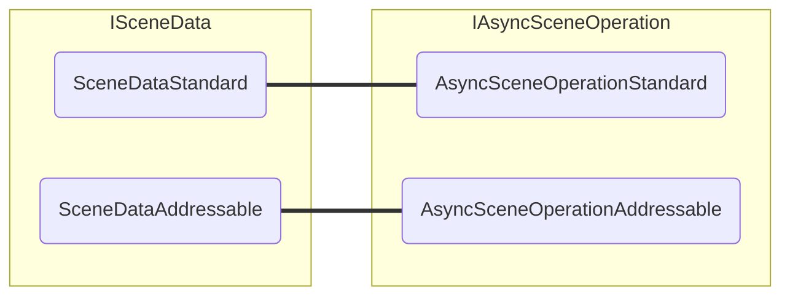

# Async Scene Operation

The `IAsyncSceneOperation` interface is a way to abstract non-addressable and addressable async operations.
The standard workflow returns an `AsyncOperation` object, that does not link directly to the loaded scene, while the addressable workflow returns an `AsyncOperationHandle<SceneInstance>` with a direct reference to the scene.

## `IAsyncSceneOperation` interface

The `IAsyncSceneOperation` interface simply defines:

```cs
public interface IAsyncSceneOperation
{
    event Action Completed;

    float Progress { get; }
    bool IsDone { get; }
    bool HasDirectReferenceToScene { get; }

    Scene GetResult();
}
```

It exposes an event to notify its completion, whether it's done and its progress, much like the regular `AsyncOperation` and `AsyncOperationHandle`.
Additionally, it also has a property to return whether this `IAsyncSceneOperation` has a direct reference to a scene, and finally a method to get the resulting scene.

## Implementations

There is one implementations of this interface for each workflow: `AsyncSceneOperationStandard` and `AsyncSceneOperationAddressable`.

|   | `AsyncSceneOperationStandard` | `AsyncSceneOperationAddressable`
| :-- | :--: | :--:
| **Async Operation Type** | `AsyncOperation` | `AsyncOperationHandle<SceneInstance>`
| **Has Reference to Scene** | ❌ | ✅

## Creation

You don't need to manually create an `IAsyncSceneOperation`, since it's done internally by the `ISceneData` implementations when calling `ISceneData.LoadSceneAsync` and `ISceneData.UnloadSceneAsync`.
As the `ISceneData` also has two implementations, it will create the correct `IAsyncSceneOperation` type based on its workflow.


