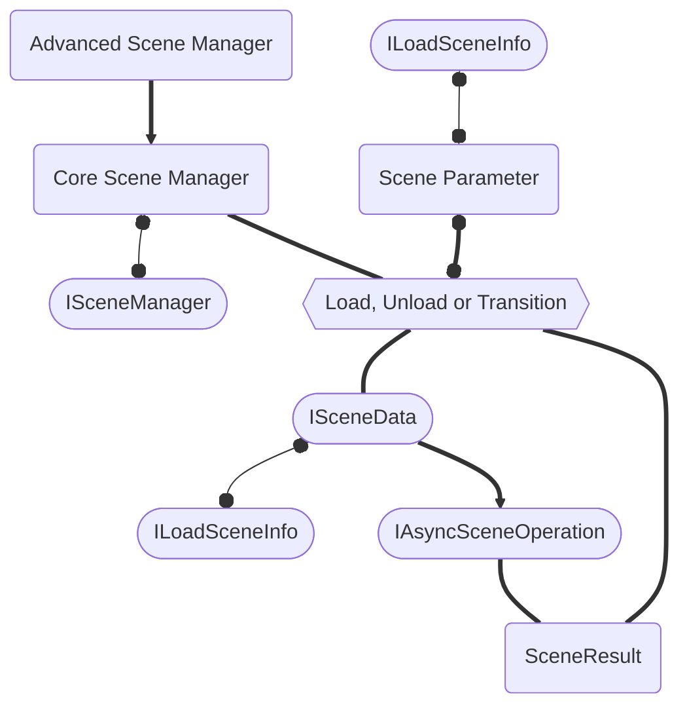

# Core Concepts

There are some key structures that need to be understood in order to dive deep into the logic of the Advanced Scene Manager.

## Architecture

This is an overview of the Advanced Scene Manager architecture. We will dive into each individual component in the next pages.
Consider this flowchart:

- The `AdvancedSceneManager` is a static implementation of a `CoreSceneManager`, which contains all the logic to perform **Scene Operations**.
- The `CoreSceneManager` is an implementation of the `ISceneManager` interface, that by itself only defines "low-level" **Scene Operations** methods that receive `SceneParameter` arguments.
- The `SceneParameter` struct is an abstraction to handle a single `ILoadSceneInfo` or multiple (`ILoadSceneInfo[]`).
- The `ILoadSceneInfo` interface is an abstraction of a reference to a scene. It has the following implementations:
  - `LoadSceneInfoName`: name or path
  - `LoadSceneInfoIndex`: build index
  - `LoadSceneInfoScene`: a loaded scene
  - `LoadSceneInfoAddress`: an addressable address
  - `LoadSceneInfoAssetReference`: an `AssetReference`
- The **Scene Operations** called by the `CoreSceneManager` will use `ISceneData` implementations internally, as it stores the `ILoadSceneInfo` used to load a scene and also stores an `IAsyncSceneOperation` that can reference both the load or unload operation.
- A completed **Scene Operation** will return a `SceneResult` struct, that can hold a single or multiple scenes, depending on the `SceneParameter` method input.

:::info
**Scene Operations** refer to the Load, Unload and Transition operations.
:::

We will cover each of these structures in the next pages.