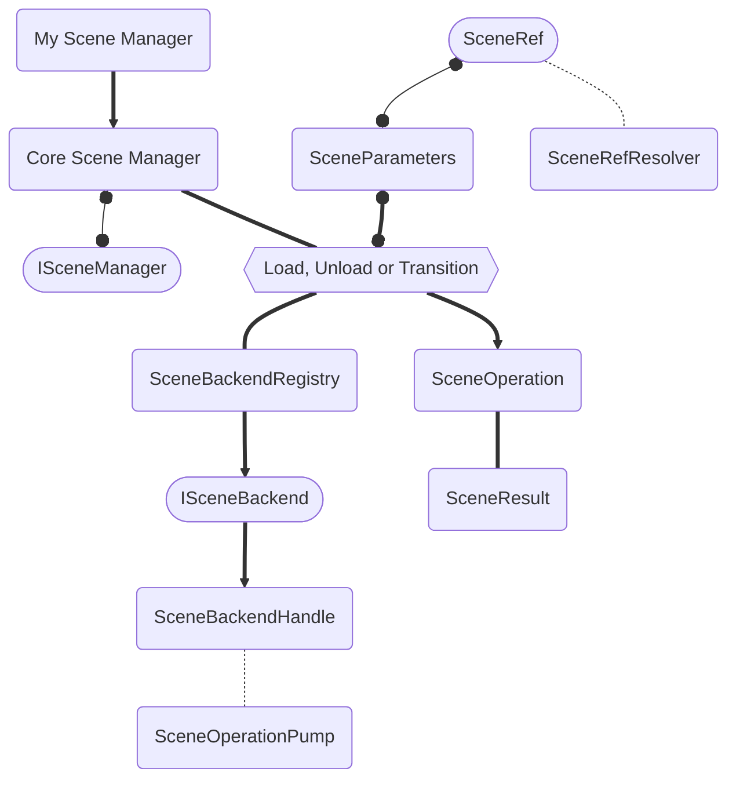

# Core Concepts

There are some key structures that need to be understood in order to dive deep into the logic of the My Scene Manager.

## Architecture

This is an overview of the My Scene Manager architecture. We will dive into each individual component in the next pages.
Consider this flowchart:

```mermaid
flowchart TB
  asm(My Scene Manager)
  sd(Core Scene Manager)
  isd([ISceneManager])
  so{{Load, Unload or Transition}}
  sp(SceneParameters)
  sr([SceneRef])
  res(SceneRefResolver)

  asm ==> sd
  sd o--o isd
  sd === so
  sr o--o sp
  sp o==o so
  sr -.- res

  reg(SceneBackendRegistry)
  be([ISceneBackend])
  h(SceneBackendHandle)
  op(SceneOperation)
  pump(SceneOperationPump)
  result(SceneResult)

  so === reg
  reg ==> be
  be ==> h
  h -.- pump
  so ==> op
  op === result
```

- The `MySceneManager` is a static implementation of a `CoreSceneManager`, which contains all the logic to perform **Scene Operations**.
- The `CoreSceneManager` is an implementation of the `ISceneManager` interface, which defines **four** async methods: `LoadAsync`, `UnloadAsync`, `TransitionAsync` and `ReloadActiveSceneAsync`. A name, a build index, an address, an `AssetReference` or an array of any of them all reach the same method, because `SceneParameters` converts from each.
- The `SceneParameters` struct is an abstraction to handle a single `SceneRef` or multiple (`SceneRef[]`), plus which one to activate.
- The `SceneRef` struct is a reference to a scene. It is a single struct with a `SceneRefKind` discriminator rather than a family of types, which is what keeps build indices from boxing.
- A bare string is a **`Key`**, which the `SceneRefResolver` settles into a build index or an address before the operation runs.
- The `SceneBackendRegistry` picks an `ISceneBackend` for each resolved kind — the standard Unity Scene Manager or Addressables — and the backend hands back a `SceneBackendHandle`.
- The `SceneOperationPump` ticks live handles on the player loop, which is what reports progress and resumes awaiters without a `Task` round-trip.
- Every operation returns a `SceneOperation` **immediately**, synchronously, as a live handle on the work. A completed one carries a `SceneResult`, that can hold a single or multiple scenes.

:::info
**Scene Operations** refer to the Load, Unload and Transition operations.
A Reload operation is considered a Transition operation.
:::

We will cover each of these structures in the next pages.

:::info[Coming from 4.x?]
Three of these are new names for things you already know — `SceneRef` for `ILoadSceneInfo`, `ISceneBackend` for `ISceneData`, `SceneOperation` for the returned `Task`. The [upgrade guide](../upgrades/from-4-to-5.md) maps every method.

If you are new to the package, you can ignore that entirely.
:::
