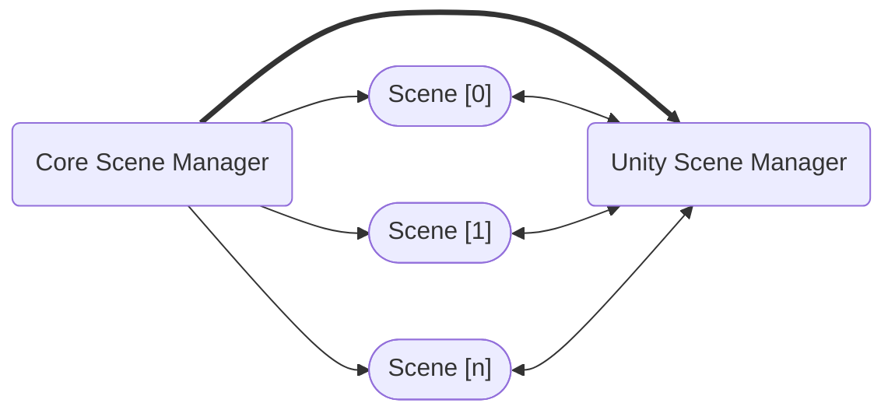

# Core Scene Manager

The **Core Scene Manager** is the most important piece of the package.
It is responsible for performing **Scene Operations** in coordination with the **Unity Scene Manager**.

## `ISceneManager` interface

The `ISceneManager` interface exposes a few methods and events to standardize the **Scene Operations**:

```cs
public interface ISceneManager : IDisposable
{
    event Action<Scene, Scene> ActiveSceneChanged;
    event Action<Scene> SceneUnloaded;
    event Action<Scene> SceneLoaded;
    event Action<SceneOperation> OperationStarted;

    int LoadedSceneCount { get; }
    int TotalSceneCount { get; }

    void SetActiveScene(Scene scene);

    SceneOperation TransitionAsync(SceneParameters sceneParameters, LoadingScreen loadingScreen = null);

    SceneOperation ReloadActiveSceneAsync(LoadingScreen loadingScreen = null);

    SceneOperation LoadAsync(SceneParameters sceneParameters);

    SceneOperation UnloadAsync(SceneParameters sceneParameters);

    Scene GetActiveScene();

    bool TryGetLoadedSceneAt(int index, out Scene scene);

    Scene GetLastLoadedScene();

    bool TryGetLoadedSceneByName(string name, out Scene scene);
}
```

The two lookups are `Try` methods: they answer whether a scene is there instead of throwing when it is not, so `TryGetLoadedSceneAt` is safe to call while `LoadedSceneCount` is moving under a load or unload elsewhere. `TryGetLoadedSceneByName` sees scenes that have **finished** loading only — a scene still on its way is not one of them, so it is not a guard against starting the same load twice. For that, keep the `SceneOperation` the first `LoadAsync` returned.

:::info
**Four async methods cover every case.** `SceneParameters` and `LoadingScreen` convert from every kind of reference, so loading one scene by name and five by `AssetReference` are the same method with different arguments.

Progress and cancellation are properties of the work, not of the request, so they live on the returned [`SceneOperation`](./scene-operation.md).
:::

You will find many similarities between Unity's [SceneManager](https://docs.unity3d.com/ScriptReference/SceneManagement.SceneManager.html) class, and that's both for maintaining an easy learning curve as well as because some of these operations will end up calling the _Unity Scene Manager_ internally (like `SetActiveScene` for instance).

The package includes the `CoreSceneManager` implementation that is capable of handling both **addressable** and **non-addressable** scene operations. You can use its implementation as a reference to **build your own** Scene Manager if you need.

The `CoreSceneManager` is expected to be used as a layer on top of the Unity `SceneManager`, with additional functionality. When creating a `CoreSceneManager` you can decide whether you want it to manage scenes that have been loaded already or not.


```mermaid
flowchart LR
    usm(Unity Scene Manager)
    scd(Core Scene Manager)

    scd ==> usm

    scd --> s_a(["Scene [0]"]) <--> usm
    scd --> s_b(["Scene [1]"]) <--> usm
    scd --> s_n(["Scene [n]"]) <--> usm

```

The `ISceneManager` interface defines that the `LoadAsync`, `UnloadAsync`, `TransitionAsync` and `ReloadActiveSceneAsync` methods return a [`SceneOperation`](./scene-operation.md) — **synchronously**, before the work starts.
This means you can _await_ it, or subscribe to the `SceneLoaded` or `SceneUnloaded` events to receive the same scenes.

:::info
You can also wait for these methods in coroutines:

```cs
yield return sceneManager.LoadAsync("my-scene").ToCoroutine();
```
:::

All four also receive a `SceneParameters` struct.
So one method covers a build index, a name, a path, an address or an array of any of them.

## Constructor

You can create a `CoreSceneManager` using three constructors:

```cs
// Creates a Core Scene Manager including all currently loaded scenes. Useful for most cases.
// Should not be called on `Awake()`, since it runs before the scene is loaded.
new CoreSceneManager(addLoadedScenes: true);

// Creates an empty Core Scene Manager. Useful if you are doing this before any scene loads or in a bootstrap scene.
new CoreSceneManager();

// Creates a Core Scene Manager including an array of scenes. Useful when you want to include only a specific set of scenes to it.
new CoreSceneManager(initializationScenes: new Scene[]);
```

:::note
You don't need to manually create a `CoreSceneManager` instance if you're using the `MySceneManager`.
:::

## Scene Parameters

`SceneParameters` is a struct to simplify passing single or multiple scenes as parameters for the **Scene Operations**.

```cs
public readonly struct SceneParameters
{
    public readonly int Length;

    public readonly SceneRef GetSceneRef();

    public readonly SceneRef[] GetSceneRefs();

    public readonly bool ShouldSetActive();

    public readonly int GetIndexToActivate();
}
```

It allows the definition of a single method that can perform operations for single or multiple scenes.
Ideally, you should rely on the implicit conversions instead of manually creating an instance for each call.
For example:

```cs
// You don't need to do this:
sceneManager.LoadAsync(new SceneParameters(SceneRef.FromKey("my-scene")));

// The conversion does it for you:
sceneManager.LoadAsync("my-scene");
```

Reach for the explicit constructor when you need to say which scene becomes active:

```cs
sceneManager.LoadAsync(new SceneParameters("my-scene", true));
sceneManager.LoadAsync(new SceneParameters(new SceneRef[] { 1, 2, 3 }, 1));
```

## Scene Result

Just like `SceneParameters`, the `SceneResult` simplifies returning a single or multiple scenes as result of a **Scene Operation**.

```cs
public readonly struct SceneResult
{
    public readonly Scene GetScene();

    public readonly Scene[] GetScenes();
}
```