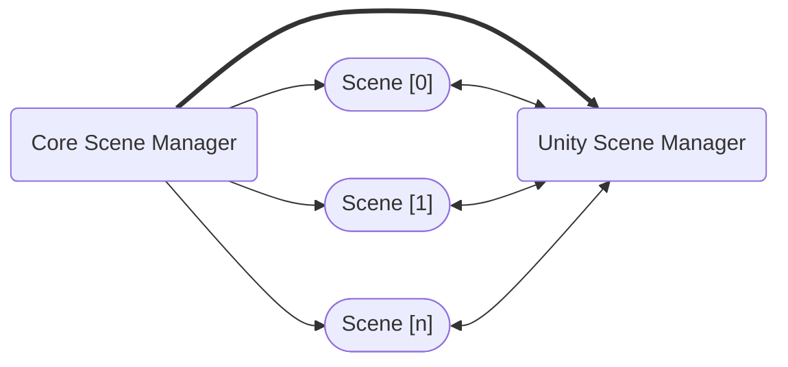

# Core Scene Manager

The **Core Scene Manager** is the most important piece of the package.
It is responsible for performing **Scene Operations** in coordination with the **Unity Scene Manager**.

## `ISceneManager` interface

The `ISceneManager` interface exposes a few methods and events to standardize the **Scene Operations**:

```cs
public interface ISceneManager : IDisposable
{
    event Action<Scene, Scene> ActiveSceneChanged;
    event Action<Scene> SceneUnloaded;
    event Action<Scene> SceneLoaded;

    int LoadedSceneCount { get; }
    int TotalSceneCount { get; }

    void SetActiveScene(Scene scene);

    Task<SceneResult> TransitionAsync(SceneParameters sceneParameters, ILoadSceneInfo intermediateSceneReference = default, CancellationToken token = default);

    Task<SceneResult> ReloadActiveSceneAsync(ILoadSceneInfo intermediateSceneReference = null, CancellationToken token = default);

    Task<SceneResult> LoadAsync(SceneParameters sceneParameters, IProgress<float> progress = null, CancellationToken token = default);

    Task<SceneResult> UnloadAsync(SceneParameters sceneParameters, CancellationToken token = default);

    Scene GetActiveScene();

    Scene GetLoadedSceneAt(int index);

    Scene GetLastLoadedScene();

    Scene GetLoadedSceneByName(string name);
}
```

You will find many similarities between Unity's [SceneManager](https://docs.unity3d.com/ScriptReference/SceneManagement.SceneManager.html) class, and that's both for maintaining an easy learning curve as well as because some of these operations will end up calling the _Unity Scene Manager_ internally (like `SetActiveScene` for instance).

The package includes the `CoreSceneManager` implementation that is capable of handling both **addressable** and **non-addressable** scene operations. You can use its implementation as a reference to **build your own** Scene Manager if you need.

The `CoreSceneManager` is expected to be used as a layer on top of the Unity `SceneManager`, with additional functionality. When creating a `CoreSceneManager` you can decide whether you want it to manage scenes that have been loaded already or not.



The `ISceneManager` interface defines that the `LoadAsync`, `UnloadAsync`, `TransitionAsync` and `ReloadActiveSceneAsync` methods return a `Task<SceneResult>`.
This means you can _await_ those methods if they are implemented with the _async_ keyword, or you can subscribe to the `SceneLoaded` or `SceneUnloaded` events to receive the same scenes you would via the _async_ methods.

:::info
You can also wait for these methods in coroutines by converting them to a `WaitTask`:

```cs
yield return CoreSceneManager.LoadAsync("my-scene").ToWaitTask();
```
:::

Both these methods also receive a `SceneParameter` struct.
So, instead of having multiple methods for receiving the scene's build index or the scene's name, we simply have a struct.

## Constructor

You can create a `CoreSceneManager` using three constructors:

```cs
// Creates a Core Scene Manager including all currently loaded scenes. Useful for most cases.
// Should not be called on `Awake()`, since it runs before the scene is loaded.
new CoreSceneManager(addLoadedScenes: true);

// Creates an empty Core Scene Manager. Useful if you are doing this before any scene loads or in a bootstrap scene.
new CoreSceneManager();

// Creates a Core Scene Manager including an array of scenes. Useful when you want to include only a specific set of scenes to it.
new CoreSceneManager(initializationScenes: new Scene[]);
```

:::note
You don't need to manually create a `CoreSceneManager` instance if you're using the `MySceneManager`.
:::

## Scene Parameter

`SceneParameter` is a struct to simplify passing single or multiple scenes as parameters for the **Scene Operations**.

```cs
public readonly struct SceneParameters
{
    public readonly int Length;

    public readonly ILoadSceneInfo GetLoadSceneInfo();

    public readonly ILoadSceneInfo[] GetLoadSceneInfos();

    public readonly bool ShouldSetActive();

    public readonly int GetIndexToActivate();
}
```

It allows the definition of a single method that can perform operations for single or multiple scenes.
Ideally, you should use the extension methods that build the `SceneParameters` internally instead of manually creating an instance for each call.
For example:

```cs
// You don't need to do this:
CoreSceneManager.LoadAsync(new SceneParameters(new LoadSceneInfoName("my-scene")));

// Use the extension method instead:
CoreSceneManager.LoadAsync("my-scene");
```

## Scene Result

Just like the `SceneParameter`, the `SceneResult` simplifies returning a single or multiple scenes as result of a **Scene Operation**.

```cs
public readonly struct SceneResult
{
    public readonly Scene GetScene();

    public readonly Scene[] GetScenes();
}
```