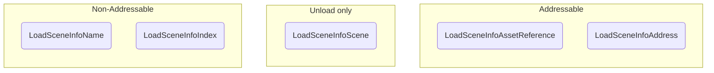

# Load Scene Info

The **Load Scene Info** is an object that holds a reference to a scene to be loaded (or unloaded) and validates whether it _can_ reference a loaded scene.

## `ILoadSceneInfo` interface

The `ILoadSceneInfo` interface simply defines:

```cs
public interface ILoadSceneInfo
{
  LoadSceneInfoType Type { get; }

  object Reference { get; }

  bool CanBeReferenceToScene(Scene scene);
}
```

Since the `Reference` field can hold any type of reference, the scene manager will be responsible for deciding what to do with its value.
The `LoadSceneInfoType` is a simple enum that helps converting the `Reference` value without casting the `ILoadSceneInfo` object.
The load scene info simply holds these references, and that's why the implementations included with the package are all **readonly structs**.

## Load Scene Info Types

You can choose to work with **five** load scene infos:



* The `LoadSceneInfoName`, referencing a scene's name.
* The `LoadSceneInfoIndex`, referencing a scene's build index.
* The `LoadSceneInfoScene`, referencing a loaded scene's struct (used for unloading scenes only).
* The `LoadSceneInfoAssetReference`, referencing a scene's Addressable Asset Reference.
* The `LoadSceneInfoAddress`, referencing a scene's Addressable Address.

You can also build your own `ILoadSceneInfo` implementation if have special needs, but that will probably require you to build a scene manager to interpret its `Reference` value as well.

When **unloading** a scene, the `CoreSceneManager` will look for any of its loaded scenes that match the `ILoadSceneInfo.Reference` value, be it the scene handle, name, path, build index or addressable references.

That means that the **preferable** way to unload scenes is through `LoadSceneInfoScene`, as it holds a **direct reference** to the target scene, however you can use any `ILoadSceneInfo` type.

:::warning
If you have multiple identical scenes loaded, unloading by an `ILoadSceneInfo` will unload the last loaded scene that matches the reference.
:::

:::info
When unloading addressable scenes, their resources will be released by calling `Addressables.UnloadSceneAsync` internally.
:::