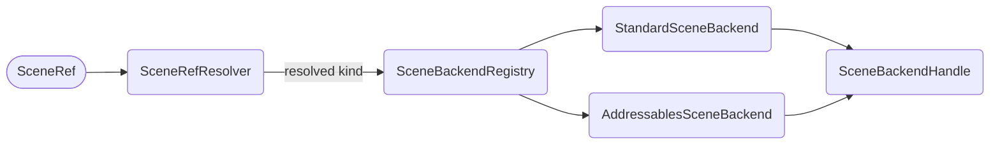

# Scene Backend

A **backend** is the thing that actually loads a scene. There are two in the box — the Unity Scene Manager and Addressables — and `ISceneBackend` is what makes that choice a lookup rather than a branch.

This replaces `4.x`'s `ISceneData` and `SceneDataBuilder`.

## The interface

```cs
public interface ISceneBackend
{
  bool CanHandle(SceneRefKind kind);

  SceneBackendHandle Load(SceneRef sceneRef);
  SceneBackendHandle Unload(SceneBackendHandle handle);

  float GetProgress(SceneBackendHandle handle);
  bool IsDone(SceneBackendHandle handle);

  bool TryResolveScene(SceneBackendHandle handle, out Scene scene);
}
```

In `4.x` the addressable-or-not decision was re-made at several points inside a single operation. Here it happens **once**, when the resolved `SceneRefKind` is handed to the registry:



| Kind | Backend |
|---|---|
| `BuildIndex`, `Scene` | `StandardSceneBackend` |
| `Address`, `AssetReference` | `AddressablesSceneBackend` |
| `Key`, `None` | Rejected — reaching selection with an unresolved key means the resolver was skipped |

## The one honest difference between them

`TryResolveScene` is the only method whose answer genuinely differs per backend, and it differs by **returning `false`** rather than by warning and handing back a default:

- `AddressablesSceneBackend` gets a `SceneInstance` back from Addressables, so it can name its own scene directly.
- `StandardSceneBackend` cannot. The Unity Scene Manager has no API that says "this `AsyncOperation` produced that `Scene`", so the honest answer is "no", and the scene is matched afterwards by the linker.

In `4.x` this asymmetry was a warn-and-return-default, which meant a correct operation logged a warning.

## Handles

`SceneBackendHandle` is a **readonly struct** — a value, not an object — carrying the backend that owns it, the `SceneRef` it came from, the `Scene` once known, and the underlying Unity operation.

Handles are ticked by the `SceneOperationPump` on the player loop. `4.x` polled with `await Task.Yield()` once per frame per operation group, round-tripping through the `SynchronizationContext` every time and reporting progress whether or not the value had moved. One pump, one pass, and `Progressed` fires only past an epsilon.

## Writing your own backend

`SceneBackendRegistry.Register` puts yours ahead of the defaults — registration order decides precedence, and the last registered wins:

```cs
public class MyBackend : ISceneBackend
{
  public bool CanHandle(SceneRefKind kind) => kind == SceneRefKind.Address;
  // ...
}

SceneBackendRegistry.Register(new MyBackend());
```

:::info
This is the extension point that `4.x` did not have. Supporting a different asset-delivery system used to mean forking `SceneDataBuilder`; now it means implementing six methods and registering them.
:::

:::warning
The registry is static, so a registration made in the editor survives a disabled Domain Reload. Register from a `[RuntimeInitializeOnLoadMethod]` rather than from arbitrary code, and be aware that tests which register a backend need to reset it afterwards.
:::
