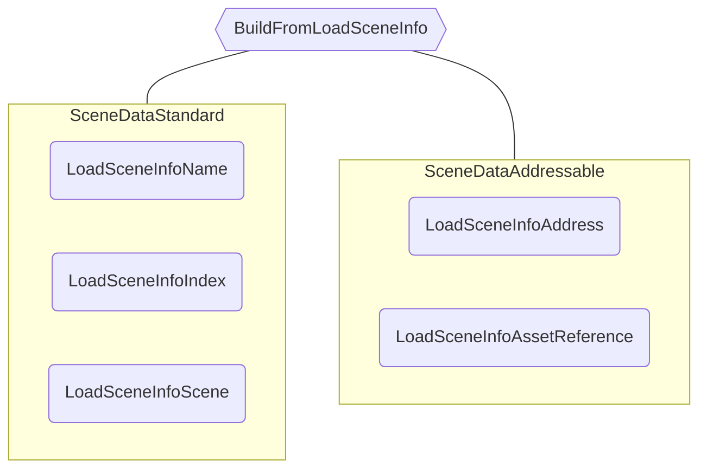

# Scene Data

The `ISceneData` implementations are used internally by the Core Scene Manager to link a loaded scene with its origin `ILoadSceneInfo` and its `IAsyncSceneOperation`.
This information is used mostly to be able to correctly handle Addressable operations, but is also used by the non-addressable workflow.

## `ISceneData` interface

The `ISceneData` interface defines:

```cs
public interface ISceneData
{
    IAsyncSceneOperation AsyncOperation { get; }
    ILoadSceneInfo LoadSceneInfo { get; }
    Scene SceneReference { get; }

    void SetSceneReferenceManually(Scene scene);

    void UpdateSceneReference();

    bool MatchesLoadSceneInfo(ILoadSceneInfo loadSceneInfo);

    IAsyncSceneOperation LoadSceneAsync();

    IAsyncSceneOperation UnloadSceneAsync();
}
```

It holds a reference to the original `ILoadSceneInfo` that was used to load a scene, the scene reference and an `IAsyncSceneOperation` that can refer to either the load or unload operation, depending on the scene state.

:::info
When the first scenes are added to the `CoreSceneManager` on its construction, they are assigned a `LoadSceneInfoScene` as its `ILoadSceneInfo`.
:::

The methods `SetSceneReferenceManually()` and `UpdateSceneReference()` are used by the non-addressable and addressable workflows respectively.
The first one is used to manually assign which scene has been loaded by the standard workflow, as it is not exposed via the Unity `SceneManager` methods.
The latter is used to update the scene reference based on the `IAsyncSceneOperation` result, as the addressable workflow returns which scene has been loaded.

Finally, the `ISceneData` also defines the `LoadSceneAsync` and `UnloadSceneAsync` methods, that internally calls the `SceneManager` or `Addressable` APIs based on its implementation.

There are only two `ISceneData` implementations: the `SceneDataStandard` and `SceneDataAddressable`.

## Creating a Scene Data instance

Since the type of the Scene Data relies on the `ILoadSceneInfo` type, it is created by a helper class: `SceneDataBuilder`.

```cs
public static class SceneDataBuilder
{
    public static ISceneData BuildFromLoadSceneInfo(ILoadSceneInfo sourceLoadSceneInfo);

    public static ISceneData BuildFromScene(Scene scene);
}
```

Building from the `ILoadSceneInfo` will generate:



Building from a loaded scene will always return a `LoadSceneInfoScene`, since it's the most reliable scene reference.

## Operating Scene Data

The `CoreSceneManager` operates with Scene Data internally to cache the loaded scenes and to orchestrate the **Scene Operations**.
Since some Scene Data operations do not relate directly to the `CoreSceneManager`, its usage is implemented in an utility class: `SceneDataUtilities`.

```cs
public static class SceneDataUtilities
{
    public static void LinkLoadedScenesWithSceneDataArray(ISceneData[] sceneDataArray, IList<ISceneData> sceneDatasToExclude);

    public static ISceneData[] GetLoadedSceneDatasWithLoadSceneInfos(ILoadSceneInfo[] sourceSceneInfos, IList<ISceneData> loadedSceneDataList);

    public static Scene[] GetScenesFromSceneDataArray(ISceneData[] sceneDataArray);

    public static float GetAverageSceneLoadOperationProgress(ISceneData[] sceneDataArray);

    public static bool TryLinkLoadedSceneWithSceneData(Scene scene, IList<ISceneData> sceneDataList, out ISceneData matchedData);

    public static bool TryGetSceneDataByLoadSceneInfo(ILoadSceneInfo loadSceneInfo, IEnumerable<ISceneData> sceneDataList, out ISceneData sceneData);

    public static bool TryGetSceneDataByLoadedScene(Scene scene, ICollection<ISceneData> sceneDataList, out ISceneData sceneData);

    public static bool HasCompletedAllSceneLoadOperations(ISceneData[] sceneDataArray);
}
```

You can use this class and the `CoreSceneManager` implementation as reference to customize your usage, if necessary.