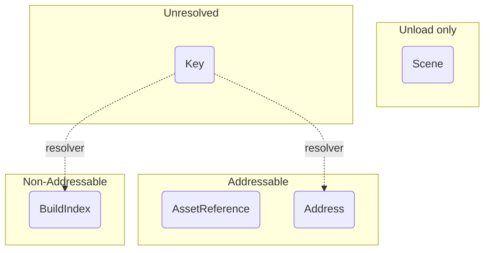

# Scene Ref

The `SceneRef` is a reference to a scene — the thing you pass to every operation. One struct covers every way of naming a scene.

## One struct for every kind of reference

```cs
public readonly struct SceneRef
{
  public SceneRefKind Kind { get; }
  public bool IsValid { get; }

  public string Key { get; }
  public int BuildIndex { get; }
  public Scene Scene { get; }
}
```

Each kind lives in its own field, with `Kind` saying which one is set. That is what keeps a build index from being boxed into an `object` and cast back out on every call.

You rarely write `SceneRef` yourself, because everything converts implicitly:

```cs
SceneRef byName  = "my-scene";                 // Key
SceneRef byIndex = 1;                          // BuildIndex
SceneRef byScene = someLoadedScene;            // Scene
SceneRef address = SceneRef.Address("my-scene");
SceneRef asset   = myAssetReference;           // AssetReference
```

## Scene Ref Kinds



* `Key` — a bare string: name, path or address. **Not yet settled**; see below.
* `BuildIndex` — a scene's build index.
* `Scene` — a loaded scene's struct (used for unloading scenes only).
* `Address` — an Addressables address, stated explicitly.
* `AssetReference` — a scene's Addressable `AssetReference`.
* `None` — points at nothing. This is what `default(SceneRef)` is.

## How a string is resolved

You never pick between an addressable and a non-addressable API. A bare string arrives as a `Key`, and the `SceneRefResolver` decides what it means:

1. **The build settings win.** If the string matches a scene name or path in the build settings, it becomes a `BuildIndex`.
2. Otherwise, Addressables is probed, and it becomes an `Address`.
3. If neither has it, resolution throws and names both places it looked.

```cs
MySceneManager.LoadAsync("my-scene");                    // build settings, or Addressables
MySceneManager.LoadAsync(SceneRef.Address("my-scene"));  // forced, and the fast path
```

`SceneRef.Address(...)` is the override and skips the probe entirely.

:::warning
Resolution is **observable behaviour**, not an implementation detail. Adding a scene to the build settings later can flip a string from Addressables to the standard backend with no code change on your side.

A key that matches both is reported at `Warning` through [`SceneManagerLog`](./logging.md), and the first resolution of each key is reported at `Verbose`, so this is diagnosable rather than mysterious.
:::

:::info
Only a never-seen key that the build settings do not have needs the Addressables catalog, and only that case suspends. Every answer is cached, so a key is probed at most once — but the first addressable-by-string resolution does pay catalog-initialisation latency.
:::

## Unloading

When **unloading** a scene, the `CoreSceneManager` looks for any of its loaded scenes that match the `SceneRef`, be it the scene handle, name, path, build index or addressable reference.

That means the **preferable** way to unload scenes is by passing the `Scene` itself, as it holds a **direct reference** to the target, however you can use any kind.

:::warning
If you have multiple identical scenes loaded, unloading by anything other than a `Scene` will unload the last loaded scene that matches the reference.
:::

:::info
When unloading addressable scenes, their resources will be released by calling `Addressables.UnloadSceneAsync` internally.
:::

## Scene Parameters

`SceneParameters` wraps one or many `SceneRef`, plus which of them to make active. It also converts implicitly, which is why every operation needs only one overload:

```cs
MySceneManager.LoadAsync("my-scene");                                  // one, not activated
MySceneManager.LoadAsync(new SceneParameters("my-scene", true));       // one, activated
MySceneManager.LoadAsync(new[] { "scene-a", "scene-b" });              // many, none activated
MySceneManager.LoadAsync(new SceneParameters(new SceneRef[] { "scene-a", "scene-b" }, 1));
```

:::note
A bare conversion never sets the scene active — you have to ask for it. The exception is `TransitionAsync`, which always activates something, because it unloads the scene you came from.
:::
