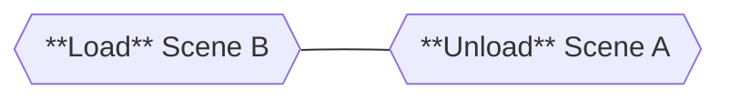
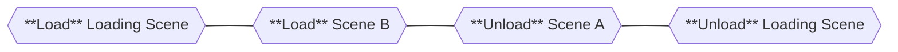

# Scene Transitions

A **Scene Transition** is an orchestration of **load** and **unload** operations to effectively transition between scenes, with or without an intermediate scene. For example, if you want to transition from scene A to scene B you could:

1. **Load** the scene B.
2. **Unload** the scene A.

That's only **two** operations, but if you want to have a loading screen as well you could:

1. **Load** the loading scene.
2. **Load** the scene B.
4. **Unload** the scene A.
3. **Unload** the loading scene.

That's **four** operations now.
The `TransitionAsync` method lets you provide the scene (or scenes) you want to transition to from the **current active scene** and if you want an intermediate scene (loading scene for example).

## Intermediate Loading Scene

To create a Loading Scene, you need to use the [Loading Components](../getting-started/loading-screens.md#loading-components).
When performing a **Scene Transition**, the `CoreSceneManager` looks for a `LoadingBehavior` component in the intermediate scene, and if it exists it is notified with the loading progress.

The `WaitForScriptedStart` and `WaitForScriptedEnd` fields in the `LoadingBehavior` control if the loading scene will have an animation to start and/or end the transition.
Effectively, this **delays** the start or the end of the **Scene Transition** operation to display a visual feedback such as a fade in/out.

When the `TransitionAsync` method is _awaited_, it will wait until the entire transition has been completed **and** the loading scene has been unloaded.
If you wish to execute an action exactly when the target scene is loaded, you can either rely on that scene's `Awake()` calls or subscribe to the `SceneLoaded` event from the `CoreSceneManager` or `MySceneManager`.