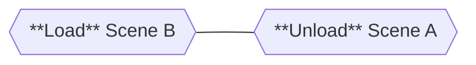
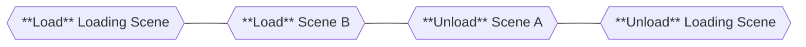

# Scene Transitions

A **Scene Transition** is an orchestration of **load** and **unload** operations to effectively transition between scenes, with or without an intermediate scene. For example, if you want to transition from scene A to scene B you could:

1. **Load** the scene B.
2. **Unload** the scene A.


```mermaid
flowchart LR

a{{"**Load** Scene B"}} --- b{{"**Unload** Scene A"}}
```

That's only **two** operations, but if you want to have a loading screen as well you could:

1. **Load** the loading scene.
2. **Load** the scene B.
4. **Unload** the scene A.
3. **Unload** the loading scene.


```mermaid
flowchart LR

a{{"**Load** Loading Scene"}} --- b{{"**Load** Scene B"}} --- c{{"**Unload** Scene A"}} --- d{{"**Unload** Loading Scene"}}
```

That's **four** operations now.
The `TransitionAsync` method lets you provide the scene (or scenes) you want to transition to from the **current active scene** and if you want an intermediate scene (loading scene for example).

## The loading screen

The second argument to `TransitionAsync` is a [`LoadingScreen`](../getting-started/loading-screens.md), not a scene. A scene name, path, address, build index or `Scene` converts to one implicitly, so the `4.x` spelling still compiles:

```cs
MySceneManager.TransitionAsync("target", "loading");        // a scene, as before
MySceneManager.TransitionAsync("target", new MyScreen());   // a prefab or UI Toolkit document
```

When the loading screen **is** a scene, the `LoadingBehavior` component in it is notified with the progress. Its `WaitForScriptedStart` and `WaitForScriptedEnd` fields control whether the transition waits for an animation to start and/or end — effectively **delaying** the transition to display visual feedback such as a fade in/out.

## Knowing where you are

When `TransitionAsync` is _awaited_, it waits until the entire transition has completed **and** the loading screen is gone. If you need a specific moment before that, the operation reports its phase:

```cs
SceneOperation op = MySceneManager.TransitionAsync("target", "loading");

op.StateChanged += o =>
{
  if (o.State == SceneOperationState.ScreenOut)
    BeginIntroCutscene();       // the loading screen is fully gone
};

await op;
```

In `4.x` this meant locating the `LoadingBehavior` by scene comparison and calling `ContinueWith` on a `TaskCompletionSource` the package exposed publicly.

You can also rely on the target scene's own `Awake()`, or subscribe to `SceneLoaded` on the operation or the manager.

:::note
A transition **always activates something** — it unloads the scene you came from, so it cannot leave nothing active. If your `SceneParameters` does not name an index to activate, index 0 is used.
:::