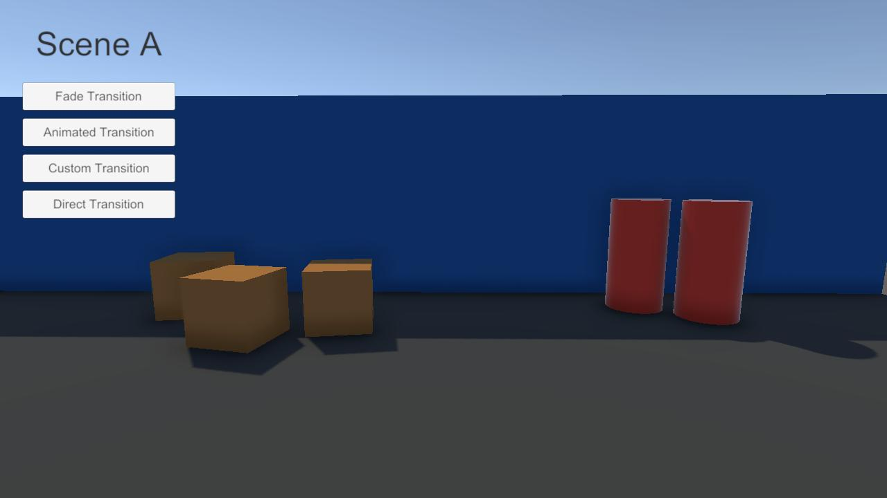

# Loading Scene Examples

This sample showcases different loading scenes and how to use **Scene Transitions** with the package.

## Installation

Import the sample through the **Package Manager**.

1. Open `Window/Package Manager`.
2. Select `My Scene Manager` from the `In Project` list.
3. In the right panel, select the **Samples** tab.
4. Click on the `Import` button on the `Loading Scene Examples` item.

The sample assets will be installed to `Samples/My Scene Manager/<version>/Loading Scene Examples`.

## Scriptable Render Pipeline Compatibility

When importing the sample into a project with an active **Scriptable Render Pipeline**, a dialog will appear asking if you want to automatically upgrade the sample materials.
This will upgrade the sample materials for both **URP** or **HDRP**.

## Adding scenes to Build Settings

After importing the sample, a dialog will appear asking to automatically add the sample scenes to the **Build Settings**.
This is required to be able to perform **Scene Transitions** with the sample scenes.
If you ignore this prompt, you'll need to manually add the scenes to the **Build Settings** if you want to play the sample.

You can easily remove the scenes added to the **Build Settings** via the menu item at `Tools/My Scene Manager/Remove 'Loading Scene Examples' from Build Settings`.

## Playing the Sample

The sample contains **two** game scenes and **three** loading scenes:

- **SceneA**
- **SceneB**
- **Loading_Fade**
- **Loading_Animated**
- **Loading_Custom**

You can start by opening either **SceneA** or **SceneB** and entering playmode.

Once into playmode, you'll notice **four** buttons on the top-left.
Each one of these buttons will trigger a scene transition to the other game scene with a different loading scene:



- **Fade Transition**: _fade in/out_ effect, progress bar and progress label feedbacks.
- **Animated Transition**: animated in/out effect.
- **Custom Transition**: custom image fill progress component and progress label feedbacks.
- **Direct Transition**: no Loading Scene.

Try out the transitions to see the effects in realtime.

## Understanding the Loading Scenes

All loading scenes have the `LoadingBehavior` component and control the loading progress via the `LoadingBehavior.Progress` events and methods.

To perform **Scene Transitions** in the game scenes, the sample uses a simple component to trigger the transitions on button click:

```cs
public class SceneTransitionTrigger : MonoBehaviour
{
    [SerializeField]
    string _targetScene;

    public void TransitionWithLoading(string loadingScene)
    {
        MySceneManager.TransitionAsync(_targetScene, loadingScene);
    }

    public void Transition()
    {
        MySceneManager.TransitionAsync(_targetScene);
    }
}
```

### Fade Transition

The `Loading_Fade` scene implements the [Creating Loading Screens](../getting-started/loading-screens.md) guide.
It features a `LoadingFader` component and both `LoadingFeedbackText` and `LoadingFeedbackSlider` components to display progress.

### Animated Transition

The `Loading_Animated` scene implements a custom animation with an `Animator` component and a custom script.
The script subscribes to the `LoadingProgress.LoadingCompleted` event of the `LoadingBehavior.Progress` and plays animations in the `Animator`.

```cs
public class AnimatedTrigger : MonoBehaviour
{
    static readonly int _isOpenHash = Animator.StringToHash("IsOpen");

    [SerializeField]
    LoadingBehavior _loadingBehavior;

    LoadingProgress _loadingProgress;
    Animator _animator;

    void Awake()
    {
        _animator = GetComponent<Animator>();

        _loadingProgress = _loadingBehavior.Progress;
        _loadingProgress.LoadingCompleted += PlayOutAnimation;

        PlayInAnimation();
    }

    public void InTransitionTrigger()
    {
        _loadingProgress.StartTransition();
    }

    public void OutTransitionTrigger()
    {
        _loadingProgress.EndTransition();
    }

    void PlayInAnimation()
    {
        _animator.SetBool(_isOpenHash, false);
    }

    void PlayOutAnimation()
    {
        _animator.SetBool(_isOpenHash, true);
    }
}
```

Both `InTransitionTrigger` and `OutTransitionTrigger` methods are called through **Animation Events**.

:::info
The **"In"** animation is played after the loading scene has loaded, and before the target scenes started loading.
The **"Out"** animation is played after the target scenes have been loaded, but before unloading the loading scene.
:::

### Custom Transition

The `Loading_Custom` scene showcases how to implement your own progress feedback component.

```cs
public class LoadingFeedbackImageFill : MonoBehaviour
{
    [SerializeField]
    LoadingBehavior _loadingBehavior;

    Image _image;

    void Awake()
    {
        _image = GetComponent<Image>();
        _image.fillAmount = 0;
    }

    void Start()
    {
        _loadingBehavior.Progress.Progressed += UpdateSlider;
    }

    void UpdateSlider(float progress) => _image.fillAmount = progress;
}
```

It subscribes to the `LoadingProgress.Progressed` event to be notified of progress changes, and uses the float value to update the image's fill amount.

## Wrap-up

With this sample, you were able to try out multiple ways of customizing the existing package components to perform **Scene Transitions** with different loading transitions and progress feedbacks.
Use the sample scenes as a starting point to create your own loading experiences ✨.