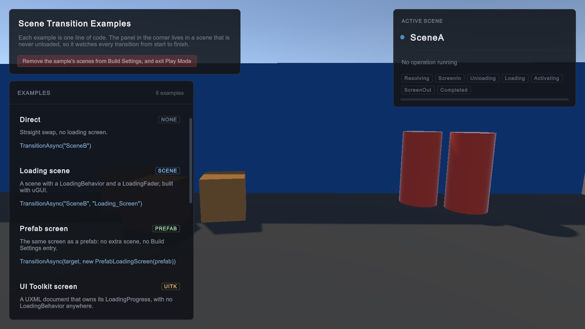

# Loading Scene Examples

This sample is two rooms and a list of examples. Every entry in the list is **one line of the package's API**, shown next to the line that runs it — loading screens from a scene, a prefab and a UI Toolkit document, multi-scene loads, reloads and awaited transitions. A persistent HUD reports every operation's phase and progress while it runs.

## Installation

Import the sample through the **Package Manager**.

1. Open `Window/Package Manager`.
2. Select `My Scene Manager` from the `In Project` list.
3. In the right panel, select the **Samples** tab.
4. Click on the `Import` button on the `Loading Scene Examples` item.

The sample assets will be installed to `Samples/My Scene Manager/<version>/Loading Scene Examples`.

## Scriptable Render Pipeline Compatibility

When importing the sample into a project with an active **Scriptable Render Pipeline**, a dialog will appear asking if you want to automatically upgrade the sample materials.
This will upgrade the sample materials for both **URP** or **HDRP**.

## Adding scenes to Build Settings

The sample reaches its scenes by name, so they have to be in the **Build Settings**.
Nothing is written on import: the Build Settings are project-wide state, so the sample asks first.

Open **SceneA** or **SceneB** and enter playmode. If any of the sample scenes is missing, the room is replaced by a prompt:

- **Add them, and exit Play Mode** adds the missing scenes. The Build Settings are read when playmode starts, so the sample exits playmode — enter it again and the sample will run.
- **Leave without changing anything** exits playmode and leaves the Build Settings alone.

To take the scenes back out, use the **Remove the sample's scenes from Build Settings, and exit Play Mode** button in the room UI. Only the sample's scenes are removed; everything else stays.

## Playing the Sample

The sample contains **two** rooms, **two** loading scenes and **two** helper scenes:

- **SceneA** and **SceneB** — the rooms. Each one transitions to the other.
- **Loading_Screen** — a uGUI loading scene built from the package's own components.
- **Loading_Animated** — a UI Toolkit loading scene with a sliding-panels animation.
- **Extra** — a scene with a spinning prop in it, loaded alongside a room by the multi-scene example.
- **SceneListenerHUD** — the persistent HUD. Loaded on demand by whichever room you start in, and never unloaded.

Start in either room. The list holds **eight** examples; click one to run it, and read the line of code underneath to see what ran:



| Example | What it runs | What it shows |
|---|---|---|
| **Direct** | `TransitionAsync("SceneB")` | A straight swap, no loading screen. |
| **Loading scene** | `TransitionAsync("SceneB", "Loading_Screen")` | A scene with a `LoadingBehavior` and a `LoadingFader`, built with uGUI. |
| **Prefab screen** | `TransitionAsync(target, new PrefabLoadingScreen(prefab))` | The same screen as a prefab: no extra scene, no Build Settings entry. |
| **UI Toolkit screen** | `TransitionAsync(target, new UIDocumentLoadingScreen(uxml, panel))` | A UXML document that owns its `LoadingProgress`, with no `LoadingBehavior` anywhere. |
| **Animated screen** | `TransitionAsync("SceneB", "Loading_Animated")` | A UI Toolkit loading scene whose gates are held until each slide finishes. |
| **Reload this scene** | `ReloadActiveSceneAsync(loadingScreen)` | Reloads whatever is active, so the same button works in both rooms. |
| **Two scenes at once** | `TransitionAsync(new[] { target, extra }, loadingScreen)` | One operation, two scenes, the first of them made active. |
| **Await the handle** | `SceneResult result = await TransitionAsync(target, loadingScreen)` | The operation is awaitable; the result carries the scenes it produced. |

Every loading screen in the sample stays up for at least **two seconds**, however fast the load turns out to be, so there is time to read what it is showing you.

### The operation HUD

The bar at the top of the screen is the `SceneListenerHUD` scene. It names the active scene, the kind of operation running, its progress, and lights each phase of the operation's lifecycle as it walks through them:

`Resolving → ScreenIn → Unloading → Loading → Activating → ScreenOut → Completed`

A **Cancel** button appears while an operation runs. Cancel one mid-flight and the timeline ends in `Canceled` instead.

The HUD lives in its own scene because a room's UI is unloaded halfway through a transition, so it could never report one from start to finish. Nothing in it uses `DontDestroyOnLoad`: `TransitionAsync` only unloads the **active** scene, so an additively loaded scene simply survives.

## Understanding the Examples

### Starting a transition

The examples list is a single `TransitionExamples` component, shared by both rooms as a prefab — only the scene it transitions to differs. Each row pairs the code it displays with the code it runs:

```cs
new Example(
    "Loading scene", "SCENE",
    "A scene with a LoadingBehavior and a LoadingFader, built with uGUI.",
    $"TransitionAsync(\"{_targetScene}\", \"{_loadingScene}\")",
    () => MySceneManager.TransitionAsync(_targetScene, _loadingScene)),
```

Nothing in it reports progress or watches phases — the HUD does that for every operation the sample starts. That is the arrangement worth copying: the code that starts a transition does not have to know anything about the code that displays it.

Two of the rows do a little more. The multi-scene example builds a `SceneParameters` from an array — the first scene is made active unless the parameters name another:

```cs
SceneParameters parameters = new[] { _targetScene, _additiveScene };
MySceneManager.TransitionAsync(parameters, _loadingScene);
```

And the awaited example is `async void`, the same shape a button handler in your own project would have. The operation is cancelled if the object goes away mid-flight, which is what `CancelWith` is for:

```cs
async void AwaitTransition()
{
    SceneResult result = await MySceneManager
        .TransitionAsync(_targetScene, _loadingScene)
        .CancelWith(destroyCancellationToken);

    Debug.Log($"Transition finished with {result.GetScenes().Length} scene(s) loaded.");
}
```

:::info
The sample touches `MySceneManager` from `Start`, never from `Awake` or `OnEnable`. The static manager is created after the first scene has finished loading, so reaching for it any earlier throws when the scene happens to be the first one.
:::

### Watching every operation

`OperationHud` subscribes once and every operation the sample starts reports itself:

```cs
void Start()
{
    _manager = MySceneManager.Default;

    _manager.OperationStarted += OnOperationStarted;
    _manager.ActiveSceneChanged += OnActiveSceneChanged;
}

void OnOperationStarted(SceneOperation operation)
{
    operation.Progressed += OnProgressed;
    operation.StateChanged += OnStateChanged;
    operation.Completed += OnCompleted;
}
```

`operation.State` is compared against the timeline to light the phase chips, and `operation.Cancel()` is what the **Cancel** button calls. See [Scene Operation](../advanced-usage/scene-operation.md) for the handle's full surface.

### The loading scene

`Loading_Screen` is the [Creating Loading Screens](../getting-started/loading-screens.md) guide as a scene, built entirely from package components:

- `LoadingBehavior` on the canvas root, anchoring the `LoadingProgress`.
- `LoadingFader` on the same `CanvasGroup`, holding the transition for the length of each fade.
- `LoadingFeedbackSlider` and `LoadingFeedbackText` displaying the progress.
- `MinimumDisplayTime`, keeping the screen up for two seconds however fast the load turns out to be.

None of these are wired to each other in the Inspector. Every component below the `LoadingBehavior` finds it on its parents, and each one that needs the transition to wait takes a **hold** of its own on the progress gates. The transition waits for whoever releases last.

### The prefab screen

`PrefabLoadingScreen` shows that the loading *scene* was never the point. The `LoadingScreen.prefab` it instantiates is the exact same hierarchy as `Loading_Screen` — the scene is built from the prefab — so the two are identical by construction:

```cs
public class PrefabLoadingScreen : LoadingScreen
{
    readonly GameObject _prefab;
    GameObject _instance;

    public PrefabLoadingScreen(GameObject prefab)
    {
        _prefab = prefab != null ? prefab : throw new System.ArgumentNullException(nameof(prefab));
    }

    public override SceneOperationPump.ConditionAwaiter PrepareAsync(LoadingScreenHost host, SceneOperation operation)
    {
        _instance = Object.Instantiate(_prefab);
        // Into the holder scene, so it survives the outgoing scene being unloaded.
        host.Adopt(_instance);

        BindProgress(LoadingBehaviorRegistry.TryGet(_instance, out LoadingBehavior behavior) ? behavior.Progress : null);

        return SceneOperationPump.Completed(operation);
    }

    public override void Dispose()
    {
        if (_instance != null)
            Object.Destroy(_instance);

        _instance = null;
        base.Dispose();
    }
}
```

`PrepareAsync` and `Dispose` are all it writes. A `LoadingBehavior` anywhere on the prefab is picked up through `LoadingBehaviorRegistry` and gates the transition; without one, the screen holds nothing up.

### The UI Toolkit screen

`UIDocumentLoadingScreen` goes one step further: no scene, no prefab, and no `LoadingBehavior` anywhere. It creates its own `LoadingProgress` and gates the transition on that — everything a loading screen has to do is expressed through `LoadingProgress`, and a plain C# object can hold one.

```cs
public override SceneOperationPump.ConditionAwaiter PrepareAsync(LoadingScreenHost host, SceneOperation operation)
{
    _instance = new GameObject(nameof(UIDocumentLoadingScreen));
    host.Adopt(_instance);

    UIDocument document = _instance.AddComponent<UIDocument>();
    document.panelSettings = _panelSettings;
    document.visualTreeAsset = _visualTree;
    document.sortingOrder = 50;

    _root  = document.rootVisualElement;
    _value = _root?.Q<Label>("value");
    _fill  = _root?.Q<VisualElement>("fill");

    LoadingProgress progress = new();
    progress.Progressed += OnProgressed;
    progress.LoadingCompleted += FadeOut;
    BindProgress(progress);

    // Held before the transition can read the gates, and released when each fade ends.
    progress.HoldShow(this);
    progress.HoldHide(this);

    // Delays the cue rather than the gate, so the screen stays up for its minimum.
    if (_minimumSeconds > 0)
    {
        progress.HoldCompletion(this);
        _root?.schedule.Execute(() => progress.ReleaseCompletion(this))
              .StartingIn((long)(_minimumSeconds * 1000f));
    }

    Fade(0, 1, () => progress.ReleaseShow(this));

    return SceneOperationPump.Completed(operation);
}
```

The fades run through UI Toolkit's own scheduler, so the screen needs no `MonoBehaviour` to run a coroutine.

### The animated screen

`Loading_Animated` is a loading **scene** that is not uGUI. `AnimatedLoadingScreen` is a `LoadingScreenComponent` — the base for anything that lives on a loading screen and drives, or waits on, its `LoadingProgress`. It finds the `LoadingBehavior` on the same object and, once bound, holds both gates until each slide has finished:

```cs
[RequireComponent(typeof(UIDocument))]
public class AnimatedLoadingScreen : LoadingScreenComponent
{
    protected override void OnBound()
    {
        Progress.HoldShow(this);
        Progress.HoldHide(this);

        Progress.Progressed += OnProgressed;
        Progress.LoadingCompleted += SlideOut;

        SlideIn();
    }

    void SlideIn()
    {
        // ...add the "closed" classes so the USS transition runs...
        _left.schedule.Execute(() => Progress.ReleaseShow(this)).StartingIn(Milliseconds());
    }

    void SlideOut()
    {
        // ...remove them again...
        _left.schedule.Execute(() => Progress.ReleaseHide(this)).StartingIn(Milliseconds());
    }
}
```

The gate opens when the slide finishes, not when it starts, so the outgoing scene is never unloaded behind a curtain that is still opening.

### Minimum display time

`MinimumDisplayTime` is the smallest `LoadingScreenComponent` the scene uses — it ships with the package, not the sample — and it makes a distinction worth knowing:

```cs
[AddComponentMenu("Scene Loading/Minimum Display Time")]
public class MinimumDisplayTime : LoadingScreenComponent
{
    [Min(0)]
    public float seconds = 2f;

    float _shownAt;

    protected override void OnBound()
    {
        _shownAt = Time.unscaledTime;
        Progress.HoldCompletion(this);
    }

    void Update()
    {
        if (Progress == null || Time.unscaledTime - _shownAt < seconds)
            return;

        Progress.ReleaseCompletion(this);
        enabled = false;
    }
}
```

It holds **completion**, not the hide gate. Holding the hide gate delays the transition while the screen has already been told to go, so a fade runs to its end and the remaining wait plays out on an empty screen. Holding completion delays the `LoadingCompleted` cue itself, so the screen stays up and whatever plays it out starts when it should.

## Wrap-up

With this sample, you were able to run every shape a transition can take from one list, watch each one through the same HUD, and read three loading screens — a scene, a prefab and a UI Toolkit document — that gate the same transition in the same way.
Use the `PrefabLoadingScreen` and `UIDocumentLoadingScreen` scripts as starting points to create your own loading experiences ✨.
