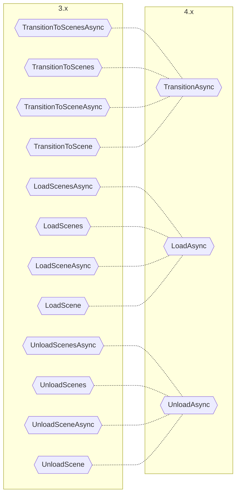

# Upgrading from 3.x to 4.x

The `4.x` update consolidates the changes in the `3.x` and simplifies a few more steps of the usage experience.
It completely removes the `ISceneLoader` implementations and adds a static `AdvancedSceneManager` class so you don't have to manually control its lifecycle.

## Key Changes

* Changed the `AdvancedSceneManager` to be a static class that auto manages its lifecycle. ([#49](https://github.com/mygamedevtools/scene-loader/issues/49))
* Converted the former `AdvancedSceneManager` to a new class `CoreSceneManager`, used internally by the new static `AdvancedSceneManager`. ([#49](https://github.com/mygamedevtools/scene-loader/issues/49))
* Added extension methods to avoid having to create `ILoadSceneInfo` instances manually. ([#49](https://github.com/mygamedevtools/scene-loader/issues/49))
* Removed the `ISceneLoader` interface and all its implementations: `SceneLoaderAsync`, `SceneLoaderCoroutine` and `SceneLoaderUniTask`. ([#39](https://github.com/mygamedevtools/scene-loader/issues/39))
* Moved the `Transition` logic to the `ISceneManager` interface directly.
* Merged single and multiple scene methods via the new `SceneParameter` struct.
* Merged all return types to `Task<SceneResult>`, which can return a single or multiple scenes, be awaited and be used in coroutines with `WaitTask`. ([#49](https://github.com/mygamedevtools/scene-loader/issues/49))
* Removed all [UniTask] references, but it's still compatible.
* Improved scene match when unloading scenes. ([#44](https://github.com/mygamedevtools/scene-loader/issues/44))([#48](https://github.com/mygamedevtools/scene-loader/issues/48))

## Code Updates

With the static `AdvancedSceneManager` available, you no longer need to manage an `ISceneManager` lifecycle.
Also, there's no longer need to manually create `ILoadSceneInfo` instances due to the addition of extension methods.
Consider this `3.x` code:

```cs
ISceneManager manager = new SceneManager();
ISceneLoader loader = new SceneLoaderAsync(manager);

loader.TransitionToSceneAsync(new LoadSceneInfo("my-target-scene"), new LoadSceneInfoName("my-loading-scene"));
```

It can be converted to this `4.x` code:

```cs
AdvancedSceneManager.TransitionAsync("my-target-scene", "my-loading-scene");
```

## No more `ISceneLoader`

The `ISceneLoader` was a layer on top of the `ISceneManager` that just added **Scene Transitions**, but with the overhead of handling one additional structure.
Now the **Scene Transitions** have been moved to the `ISceneManager` directly and no longer needs another interaction layer.
Additionally, the methods now support single or multiple scenes and all methods are async.

Update your calls according to the chart:



## Scene Manager Changes

The `ISceneManager` interface has been simplified and received the implementation of the `TransitionAsync` method:

```diff
+Task<SceneResult> TransitionAsync(SceneParameters sceneParameters, ILoadSceneInfo intermediateSceneReference = default, CancellationToken token = default);

-ValueTask<Scene[]> LoadScenesAsync(ILoadSceneInfo[] sceneInfos, int setIndexActive = -1, IProgress<float> progress = null, CancellationToken token = default);
-ValueTask<Scene> LoadSceneAsync(ILoadSceneInfo sceneInfo, bool setActive = false, IProgress<float> progress = null, CancellationToken token = default);
+Task<SceneResult> LoadAsync(SceneParameters sceneParameters, IProgress<float> progress = null, CancellationToken token = default);

-ValueTask<Scene[]> UnloadScenesAsync(ILoadSceneInfo[] sceneInfos, CancellationToken token = default);
-ValueTask<Scene> UnloadSceneAsync(ILoadSceneInfo sceneInfo, CancellationToken token = default);
+Task<SceneResult> UnloadAsync(SceneParameters sceneParameters, CancellationToken token = default);
```

Now instead of a `ValueTask<Scene>` and `ValueTask<Scene[]>`, it will return a `Task<SceneResult>` where the `SceneResult` is a simple struct that stores one or multiple scenes.
You can retrieve the scenes by calling `SceneResult.GetScenes()`.

## Advanced Scene Manager Changes

The former `AdvancedSceneManager` was an implementation of the `ISceneManager` class.
This implementation has been renamed to `CoreSceneManager` and the `AdvancedSceneManager` name has been converted to a static class that internally manages an instance of a `CoreSceneManager`.

Operationally, the static `AdvancedSceneManager` is a static wrapper to a `CoreSceneManager` instance.

The **Scene Transition** implementation from the former `SceneLoaderAsync` has been migrated to the `CoreSceneManager` class, along with a few improvements.

## Extension Methods

With extension methods, you no longer need to manually create `ILoadSceneInfo` instances:

```cs
AdvancedSceneManager.TransitionAsync("my-target-scene", "my-loading-scene");
```

This works for both the static `AdvancedSceneManager` and any `ISceneManager` implementation.
The extension methods use the arguments to build a `SceneParameter` internally, such as:

```cs
public static Task<SceneResult> TransitionAsync(this ISceneManager sceneManager, string targetSceneName, string loadingSceneName = null, CancellationToken token = default)
{
  SceneParameters targetParams = new(new LoadSceneInfoName(targetSceneName), true);
  ILoadSceneInfo loadingSceneInfo = string.IsNullOrWhiteSpace(loadingSceneName) ? null : new LoadSceneInfoName(loadingSceneName);
  return sceneManager.TransitionAsync(targetParams, loadingSceneInfo, token);
}
```

Since loading scenes by name/path and addressable address share the same signature, addressable extension methods have the "Addressable" suffix, for example:

```cs
public static Task<SceneResult> TransitionAddressableAsync(this ISceneManager sceneManager, string targetAddress, string loadingAddress = null, CancellationToken token = default);
```

## Coroutines

With the removal of the `SceneLoaderCoroutine` and the conversion of the return type to `Task<SceneResult>`, you can still wait for these methods in coroutines.
You just have to convert the task to a `WaitTask`, that can be yielded:

```cs
yield return AdvancedSceneManager.TransitionAsync("my-target-scene", "my-loading-scene").ToWaitTask();
```

You can also use the `WaitTask` to get the loaded scene:

```cs
WaitTask<SceneResult> waitTask = AdvancedSceneManager.LoadAsync("my-target-scene");
yield return waitTask;

Scene loadedScene = waitTask.Task.Result.GetScene();
```

## UniTask

The explicit [UniTask] references were removed with the `SceneLoaderUniTask`, but since it supports standard async/await workflows, you can still use [UniTask] with this package.

## Scene Unload Updates

In `3.x` you could only unload a scene via a `LoadSceneInfoScene` which contains a direct scene reference, or via the same `ILoadSceneInfo` that loaded that scene in the first place.

Now, you can use **any** valid reference to unload a scene: name, path, build index, scene handle, addressable address or `AssetReference`.

Addressable scenes can also be unloaded by any valid reference except by its build index, since it's always `-1`. To unload via an addressable reference, it must match the original `ILoadSceneInfo`: either a `LoadSceneInfoAddress` or a `LoadSceneInfoAssetReference`.

## Conclusion

The `4.x` iteration concludes the simplification initiatives started in `3.x` and matches the usability of the Unity Scene Manager, while delivering powerful upgrades.
We hope these changes improve the usage experience for new and active users.

[UniTask]: https://github.com/Cysharp/UniTask