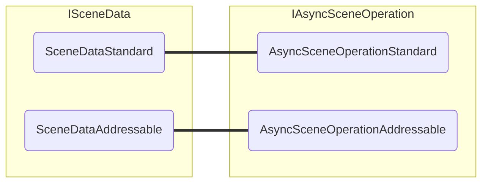

# Async Scene Operation

A interface `IAsyncSceneOperation` é uma forma de abstrair operações assíncronas addressable e não-addressable.
O fluxo padrão retorna um objeto `AsyncOperation`, que não vincula diretamente à cena carregada, enquanto o fluxo addressable retorna um `AsyncOperationHandle<SceneInstance>` com uma referência direta à cena.

## Interface `IAsyncSceneOperation`

A interface `IAsyncSceneOperation` define:

```cs
public interface IAsyncSceneOperation
{
    event Action Completed;

    float Progress { get; }
    bool IsDone { get; }
    bool HasDirectReferenceToScene { get; }

    Scene GetResult();
}
```

Ela expõe um evento para notificar sua conclusão, um indicador de progresso e um booleano que informa se a operação foi concluída — semelhante ao `AsyncOperation` e ao `AsyncOperationHandle`.
Além disso, possui uma propriedade que indica se a operação possui uma referência direta a uma cena e um método para obter a cena resultante.

## Implementações

Há uma implementação dessa interface para cada fluxo: `AsyncSceneOperationStandard` e `AsyncSceneOperationAddressable`.

|   | `AsyncSceneOperationStandard` | `AsyncSceneOperationAddressable`
| :-- | :--: | :--:
| **Tipo de Async Operation** | `AsyncOperation` | `AsyncOperationHandle<SceneInstance>`
| **Tem Referência à Cena** | ❌ | ✅

## Criação

Você não precisa criar manualmente uma `IAsyncSceneOperation`, já que isso é feito internamente pelas implementações de `ISceneData` ao chamar `ISceneData.LoadSceneAsync` e `ISceneData.UnloadSceneAsync`.
Como o `ISceneData` também possui duas implementações, ele criará o tipo correto de `IAsyncSceneOperation` com base em seu fluxo.


