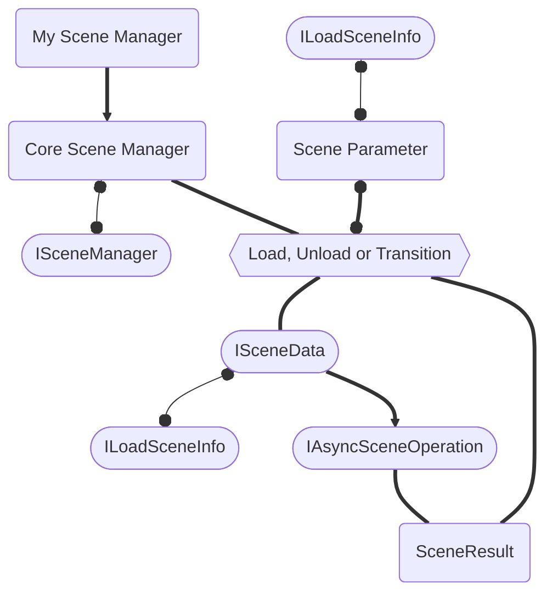

# Conceitos Chave

Existem algumas estruturas chaves que precisam ser compreendidas para que possamos explorar a fundo a lógica do My Scene Manager.

## Arquitetura

Aqui está uma visão geral da arquitetura do My Scene Manager.
Vamos explorar cada componente individual nas próximas páginas.
Considere o fluxograma:

- O `MySceneManager` é uma implementação estática de um `CoreSceneManager`, que por sua vez contém toda a lógica para realizar **Operações de Cena**.
- O `CoreSceneManager` é uma implementação da interface `ISceneManager`, que apenas define **Operações de Cena** de uma forma mais "baixo-nível" que recebem argumentos `SceneParameter`.
- A struct `SceneParameter` é uma abstração para tratar um único `ILoadSceneInfo` ou vários (`ILoadSceneInfo[]`).
- A interface `ILoadSceneInfo` é uma abstração de uma referência a uma cena. Ela possui as seguintes implementações:
  - `LoadSceneInfoName`: nome ou caminho
  - `LoadSceneInfoIndex`: índice de build (_build index_)
  - `LoadSceneInfoScene`: uma cena carregada
  - `LoadSceneInfoAddress`: o endereço Addressable
  - `LoadSceneInfoAssetReference`: um `AssetReference`
- As **Operações de Cena** chamadas pelo `CoreSceneManager` usarão implementações `ISceneData`  internamente, já que estas guardam o `ILoadSceneInfo` usado para carregar uma cena e também guardam um `IAsyncSceneOperation` que pode referenciar tanto a operação de carregamento ou descarregamento da cena.
- **Operações de Cena** concluídas retornarão um resultado `SceneResult`, que pode guardar uma cena única ou múltiplas, dependendo do `SceneParameter` fornecido na entrada do método.

:::info
**Operações de Cena** refere às operações de Carregar, Descarregar e Transicionar.
Uma operação de Recarregar é considerada uma operação de Transicionar.
:::

Vamos cobrir cada uma dessas estruturas nas próximas páginas.