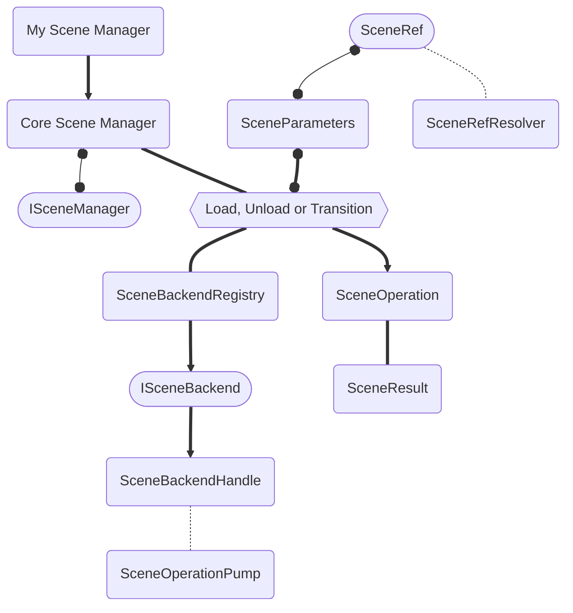

# Conceitos Chave

Existem algumas estruturas-chave que você precisa entender para se aprofundar na lógica do My Scene Manager.

## Arquitetura {/* #architecture */}

Esta é uma visão geral da arquitetura do My Scene Manager. Vamos explorar cada componente nas próximas páginas.
Veja o fluxograma:

```mermaid
flowchart TB
  asm(My Scene Manager)
  sd(Core Scene Manager)
  isd([ISceneManager])
  so{{Load, Unload or Transition}}
  sp(SceneParameters)
  sr([SceneRef])
  res(SceneRefResolver)

  asm ==> sd
  sd o--o isd
  sd === so
  sr o--o sp
  sp o==o so
  sr -.- res

  reg(SceneBackendRegistry)
  be([ISceneBackend])
  h(SceneBackendHandle)
  op(SceneOperation)
  pump(SceneOperationPump)
  result(SceneResult)

  so === reg
  reg ==> be
  be ==> h
  h -.- pump
  so ==> op
  op === result
```

- O `MySceneManager` é uma implementação estática de um `CoreSceneManager`, que por sua vez contém toda a lógica para realizar **Operações de Cena**.
- O `CoreSceneManager` é uma implementação da interface `ISceneManager`, que define **quatro** métodos async: `LoadAsync`, `UnloadAsync`, `TransitionAsync` e `ReloadActiveSceneAsync`. Um nome, um índice de build, um endereço, um `AssetReference` ou um array de qualquer um deles chegam todos no mesmo método, porque `SceneParameters` converte a partir de cada um deles.
- A struct `SceneParameters` é uma abstração para tratar um único `SceneRef` ou vários (`SceneRef[]`), além de qual deles deve ser ativado.
- A struct `SceneRef` é uma referência a uma cena. É uma única struct com um discriminador `SceneRefKind`, em vez de uma família de tipos, o que evita o _boxing_ dos índices de build.
- Uma string pura é uma **`Key`**, que o `SceneRefResolver` resolve em um índice de build ou um endereço antes de a operação rodar.
- O `SceneBackendRegistry` escolhe um `ISceneBackend` para cada tipo resolvido — o Unity Scene Manager padrão ou o Addressables — e o backend devolve um `SceneBackendHandle`.
- O `SceneOperationPump` atualiza (_tick_) os handles ativos no player loop, que é o que reporta o progresso e retoma os _awaiters_ sem uma ida e volta por uma `Task`.
- Toda operação retorna um `SceneOperation` **imediatamente**, de forma síncrona, como um handle vivo do trabalho. Um `SceneOperation` concluído carrega um `SceneResult`, que pode conter uma ou várias cenas.

:::info
**Operações de Cena** se refere às operações de carregamento (Load), descarregamento (Unload) e transição (Transition).
Uma operação de recarregamento (Reload) é considerada uma operação de transição.
:::

Vamos cobrir cada uma dessas estruturas nas próximas páginas.

:::info[Vindo da 4.x?]
Três desses são nomes novos para coisas que você já conhece — `SceneRef` no lugar de `ILoadSceneInfo`, `ISceneBackend` no lugar de `ISceneData`, `SceneOperation` no lugar da `Task` retornada. O [guia de atualização](../upgrades/from-4-to-5.md) mapeia todos os métodos.

Se você é novo no pacote, pode ignorar isso completamente.
:::
