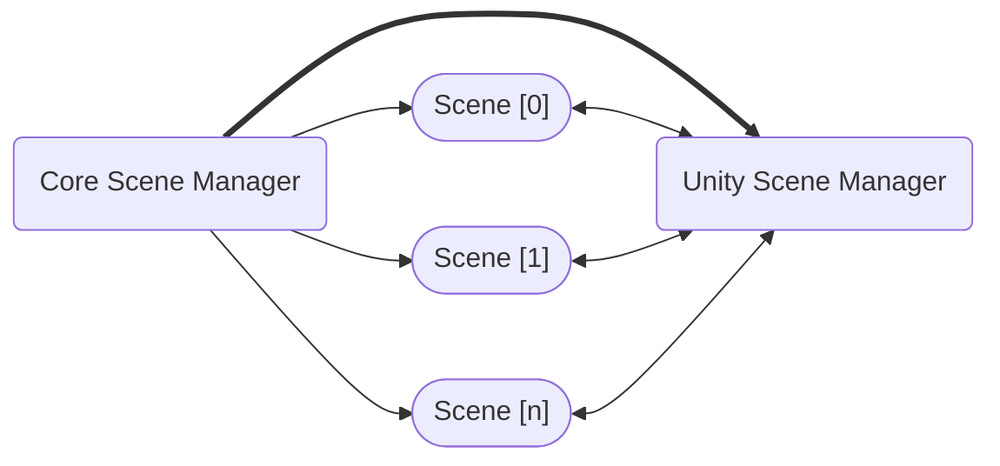

# Core Scene Manager

O **Core Scene Manager** é a peça mais importante do pacote.
Ele é responsável por realizar **Operações de Cena** em coordenação com o **Unity Scene Manager**.

## Interface `ISceneManager`

A interface ISceneManager expõe alguns métodos e eventos para padronizar as **Operações de Cena**:

```cs
public interface ISceneManager : IDisposable
{
    event Action<Scene, Scene> ActiveSceneChanged;
    event Action<Scene> SceneUnloaded;
    event Action<Scene> SceneLoaded;

    int LoadedSceneCount { get; }
    int TotalSceneCount { get; }

    void SetActiveScene(Scene scene);

    Task<SceneResult> TransitionAsync(SceneParameters sceneParameters, ILoadSceneInfo intermediateSceneReference = default, CancellationToken token = default);

    Task<SceneResult> LoadAsync(SceneParameters sceneParameters, IProgress<float> progress = null, CancellationToken token = default);

    Task<SceneResult> UnloadAsync(SceneParameters sceneParameters, CancellationToken token = default);

    Scene GetActiveScene();

    Scene GetLoadedSceneAt(int index);

    Scene GetLastLoadedScene();

    Scene GetLoadedSceneByName(string name);
}
```

Você encontrará muitas semelhanças com a classe [SceneManager](https://docs.unity3d.com/ScriptReference/SceneManagement.SceneManager.html) da Unity, tanto para manter uma curva de aprendizado suave quanto porque algumas dessas operações acabam chamando internamente o _Unity Scene Manager_ (como `SetActiveScene`, por exemplo).

O pacote inclui a implementação `CoreSceneManager`, capaz de lidar com operações de cena tanto **addressable** quanto **não-addressable**. Você pode usar essa implementação como referência para **construir seu próprio** Scene Manager, se necessário.

O `CoreSceneManager` é projetado para ser usado como uma camada acima do `SceneManager` da Unity, adicionando funcionalidades extras. Ao criar um `CoreSceneManager`, você pode decidir se ele irá gerenciar cenas que já foram carregadas ou não.



A interface `ISceneManager` define que os métodos `LoadAsync`, `UnloadAsync` e `TransitionAsync` retornam um `Task<SceneResult>`.
Isso significa que você pode usar _await_ nesses métodos se eles forem implementados como _async_, ou pode se inscrever nos eventos `SceneLoaded` ou `SceneUnloaded` para receber as mesmas cenas que receberia via métodos async.

:::info
Você também pode aguardar a conclusão desses métodos em coroutines convertendo-os para uma `WaitTasK`:

```cs
yield return CoreSceneManager.LoadAsync("my-scene").ToWaitTask();
```
:::

Esses métodos também recebem uma struct `SceneParameter`.
Assim, ao invés de ter múltiplos métodos para receber o índice da cena ou o nome da cena, usamos apenas uma struct.

## Construtor

Você pode criar um `CoreSceneManager` usando três construtores:

```cs
// Cria um Core Scene Manager incluindo todas as cenas atualmente carregadas. Útil para a maioria dos casos.
// Não deve ser chamado no `Awake()`, já que ele roda antes da cena ser carregada.
new CoreSceneManager(addLoadedScenes: true);

// Cria um Core Scene Manager vazio. Útil se você fizer isso antes de qualquer cena ser carregada ou em uma cena de bootstrap.
new CoreSceneManager();

// Cria um Core Scene Manager incluindo um array de cenas. Útil quando você quer incluir apenas um conjunto específico de cenas.
new CoreSceneManager(initializationScenes: new Scene[]);
```

:::note
Você não precisa criar manualmente uma instância de `CoreSceneManager` se estiver usando o `AdvancedSceneManager`.
:::

## Scene Parameter

`SceneParameter` é uma struct que simplifica o envio de uma ou múltiplas cenas como parâmetros para as **Operações de Cena**.

```cs
public readonly struct SceneParameters
{
    public readonly int Length;

    public readonly ILoadSceneInfo GetLoadSceneInfo();

    public readonly ILoadSceneInfo[] GetLoadSceneInfos();

    public readonly bool ShouldSetActive();

    public readonly int GetIndexToActivate();
}
```

Isso permite a definição de um único método que pode realizar operações para uma ou várias cenas.
Idealmente, você deve usar os métodos de extensão que constroem o `SceneParameters` internamente ao invés de criar uma instância manualmente para cada chamada.
Por exemplo:

```cs
// Você não precisa fazer isso:
CoreSceneManager.LoadAsync(new SceneParameters(new LoadSceneInfoName("my-scene")));

// Use o método de extensão:
CoreSceneManager.LoadAsync("my-scene");
```

## Scene Result

Assim como o `SceneParameter`, o `SceneResult` simplifica o retorno de uma ou múltiplas cenas como resultado de uma **Operação de Cena**.

```cs
public readonly struct SceneResult
{
    public readonly Scene GetScene();

    public readonly Scene[] GetScenes();
}
```