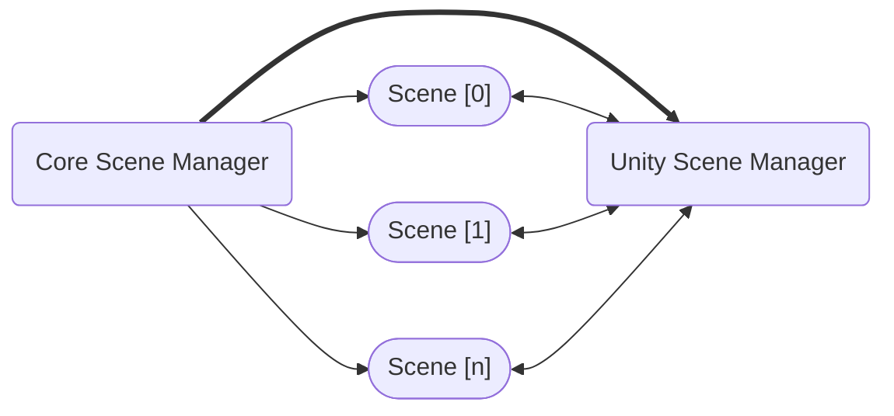

# Core Scene Manager

O **Core Scene Manager** é a peça mais importante do pacote.
Ele é responsável por realizar **Operações de Cena** em coordenação com o **Unity Scene Manager**.

## Interface `ISceneManager` {/* #iscenemanager-interface */}

A interface `ISceneManager` expõe alguns métodos e eventos para padronizar as **Operações de Cena**:

```cs
public interface ISceneManager : IDisposable
{
    event Action<Scene, Scene> ActiveSceneChanged;
    event Action<Scene> SceneUnloaded;
    event Action<Scene> SceneLoaded;
    event Action<SceneOperation> OperationStarted;

    int LoadedSceneCount { get; }
    int TotalSceneCount { get; }

    void SetActiveScene(Scene scene);

    SceneOperation TransitionAsync(SceneParameters sceneParameters, LoadingScreen loadingScreen = null);

    SceneOperation ReloadActiveSceneAsync(LoadingScreen loadingScreen = null);

    SceneOperation LoadAsync(SceneParameters sceneParameters);

    SceneOperation UnloadAsync(SceneParameters sceneParameters);

    Scene GetActiveScene();

    Scene GetLoadedSceneAt(int index);

    Scene GetLastLoadedScene();

    Scene GetLoadedSceneByName(string name);
}
```

:::info
**Quatro métodos async cobrem todos os casos.** `SceneParameters` e `LoadingScreen` convertem a partir de qualquer tipo de referência, então carregar uma cena pelo nome e cinco por `AssetReference` é o mesmo método com argumentos diferentes.

Progresso e cancelamento são propriedades do trabalho, não da requisição, então eles vivem no [`SceneOperation`](./scene-operation.md) retornado.
:::

Você encontrará muitas semelhanças com a classe [SceneManager](https://docs.unity3d.com/ScriptReference/SceneManagement.SceneManager.html) da Unity, tanto para manter uma curva de aprendizado suave quanto porque algumas dessas operações acabam chamando internamente o _Unity Scene Manager_ (como `SetActiveScene`, por exemplo).

O pacote inclui a implementação `CoreSceneManager`, capaz de lidar com operações de cena tanto **addressable** quanto **não-addressable**. Você pode usar essa implementação como referência para **construir seu próprio** Scene Manager, se necessário.

O `CoreSceneManager` é projetado para ser usado como uma camada acima do `SceneManager` da Unity, adicionando funcionalidades extras. Ao criar um `CoreSceneManager`, você pode decidir se ele irá gerenciar cenas que já foram carregadas ou não.


```mermaid
flowchart LR
    usm(Unity Scene Manager)
    scd(Core Scene Manager)

    scd ==> usm

    scd --> s_a(["Scene [0]"]) <--> usm
    scd --> s_b(["Scene [1]"]) <--> usm
    scd --> s_n(["Scene [n]"]) <--> usm

```

A interface `ISceneManager` define que os métodos `LoadAsync`, `UnloadAsync`, `TransitionAsync` e `ReloadActiveSceneAsync` retornam um [`SceneOperation`](./scene-operation.md) — de forma **síncrona**, antes de o trabalho começar.
Isso significa que você pode usar _await_ nele, ou se inscrever nos eventos `SceneLoaded` ou `SceneUnloaded` para receber as mesmas cenas.

:::info
Você também pode aguardar a conclusão desses métodos em coroutines:

```cs
yield return sceneManager.LoadAsync("my-scene").ToCoroutine();
```
:::

Os quatro métodos também recebem uma struct `SceneParameters`.
Assim, um único método cobre um índice de build, um nome, um caminho, um endereço ou um array de qualquer um deles.

## Construtor {/* #constructor */}

Você pode criar um `CoreSceneManager` usando três construtores:

```cs
// Cria um Core Scene Manager incluindo todas as cenas atualmente carregadas. Útil para a maioria dos casos.
// Não deve ser chamado no `Awake()`, já que ele roda antes da cena ser carregada.
new CoreSceneManager(addLoadedScenes: true);

// Cria um Core Scene Manager vazio. Útil se você fizer isso antes de qualquer cena ser carregada ou em uma cena de bootstrap.
new CoreSceneManager();

// Cria um Core Scene Manager incluindo um array de cenas. Útil quando você quer incluir apenas um conjunto específico de cenas.
new CoreSceneManager(initializationScenes: new Scene[]);
```

:::note
Você não precisa criar manualmente uma instância de `CoreSceneManager` se estiver usando o `MySceneManager`.
:::

## Scene Parameters {/* #scene-parameters */}

`SceneParameters` é uma struct que simplifica o envio de uma ou múltiplas cenas como parâmetros para as **Operações de Cena**.

```cs
public readonly struct SceneParameters
{
    public readonly int Length;

    public readonly SceneRef GetSceneRef();

    public readonly SceneRef[] GetSceneRefs();

    public readonly bool ShouldSetActive();

    public readonly int GetIndexToActivate();
}
```

Isso permite a definição de um único método que pode realizar operações para uma ou várias cenas.
Idealmente, você deve confiar nas conversões implícitas ao invés de criar uma instância manualmente para cada chamada.
Por exemplo:

```cs
// Você não precisa fazer isso:
sceneManager.LoadAsync(new SceneParameters(SceneRef.FromKey("my-scene")));

// A conversão faz isso por você:
sceneManager.LoadAsync("my-scene");
```

Use o construtor explícito quando precisar dizer qual cena se torna a ativa:

```cs
sceneManager.LoadAsync(new SceneParameters("my-scene", true));
sceneManager.LoadAsync(new SceneParameters(new SceneRef[] { 1, 2, 3 }, 1));
```

## Scene Result {/* #scene-result */}

Assim como o `SceneParameters`, o `SceneResult` simplifica o retorno de uma ou múltiplas cenas como resultado de uma **Operação de Cena**.

```cs
public readonly struct SceneResult
{
    public readonly Scene GetScene();

    public readonly Scene[] GetScenes();
}
```
