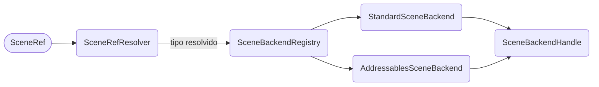

# Scene Backend

Um **backend** é o que de fato carrega uma cena. O pacote traz dois — o Unity Scene Manager e os Addressables — e `ISceneBackend` é o que transforma essa escolha em uma consulta, em vez de uma ramificação no código.

Você não precisa mexer nisso para carregar uma cena. Isso importa quando você quer saber *como* uma cena é carregada, ou quando quer adicionar um jeito próprio de carregar.

## A interface {/* #the-interface */}

```cs
public interface ISceneBackend
{
  bool CanHandle(SceneRefKind kind);

  SceneBackendHandle Load(SceneRef sceneRef);
  SceneBackendHandle Unload(SceneBackendHandle handle);

  float GetProgress(SceneBackendHandle handle);
  bool IsDone(SceneBackendHandle handle);

  bool TryResolveScene(SceneBackendHandle handle, out Scene scene);
}
```

A decisão addressable-ou-não acontece **uma vez** por operação, quando o `SceneRefKind` resolvido é entregue ao registry:



| Tipo | Backend |
|---|---|
| `BuildIndex`, `Scene` | `StandardSceneBackend` |
| `Address`, `AssetReference` | `AddressablesSceneBackend` |
| `Key`, `None` | Rejeitado — chegar à seleção com uma chave não resolvida significa que o resolver foi pulado |

## A única diferença honesta entre eles {/* #the-one-honest-difference-between-them */}

`TryResolveScene` é o único método cuja resposta realmente difere de um backend para o outro, e a diferença está em **retornar `false`** em vez de emitir um aviso e devolver um valor padrão:

- `AddressablesSceneBackend` recebe um `SceneInstance` de volta dos Addressables, então consegue apontar sua própria cena diretamente.
- `StandardSceneBackend` não consegue. O Unity Scene Manager não tem uma API que diga "este `AsyncOperation` produziu aquela `Scene`", então a resposta honesta é "não", e a cena é associada depois pelo linker.

Retornar `false` em vez de uma `Scene` padrão é o que mantém essa etapa de associação explícita, em vez de silenciosa.

## Handles {/* #handles */}

`SceneBackendHandle` é uma **readonly struct** — um valor, não um objeto — que carrega o backend dono dela, o `SceneRef` de origem, a `Scene` (assim que conhecida) e a operação subjacente da Unity.

Os handles são atualizados (_ticked_) pelo `SceneOperationPump`, uma única passagem no player loop sobre todas as operações ativas. É isso que dispara `Progressed` — e só quando o valor de fato avançou além de um pequeno epsilon, para que uma barra vinculada a ele não fique tremendo a cada frame.

## Escrevendo seu próprio backend {/* #writing-your-own-backend */}

`SceneBackendRegistry.Register` coloca o seu na frente dos padrões — a ordem de registro decide a precedência, e o último registrado vence:

```cs
public class MyBackend : ISceneBackend
{
  public bool CanHandle(SceneRefKind kind) => kind == SceneRefKind.Address;
  // ...
}

SceneBackendRegistry.Register(new MyBackend());
```

:::info
Este é o ponto de extensão para um sistema de entrega de assets diferente — um pipeline de bundles customizado, ou um SDK de loja que entrega cenas para você. Implemente seis métodos, registre o backend e todos os pontos de chamada existentes continuam funcionando.
:::

:::warning
O registry é estático, então um registro feito no editor sobrevive quando o Domain Reload está desabilitado. Registre a partir de um `[RuntimeInitializeOnLoadMethod]`, e não de código arbitrário, e tenha em mente que testes que registram um backend precisam restaurar o registry depois.
:::
