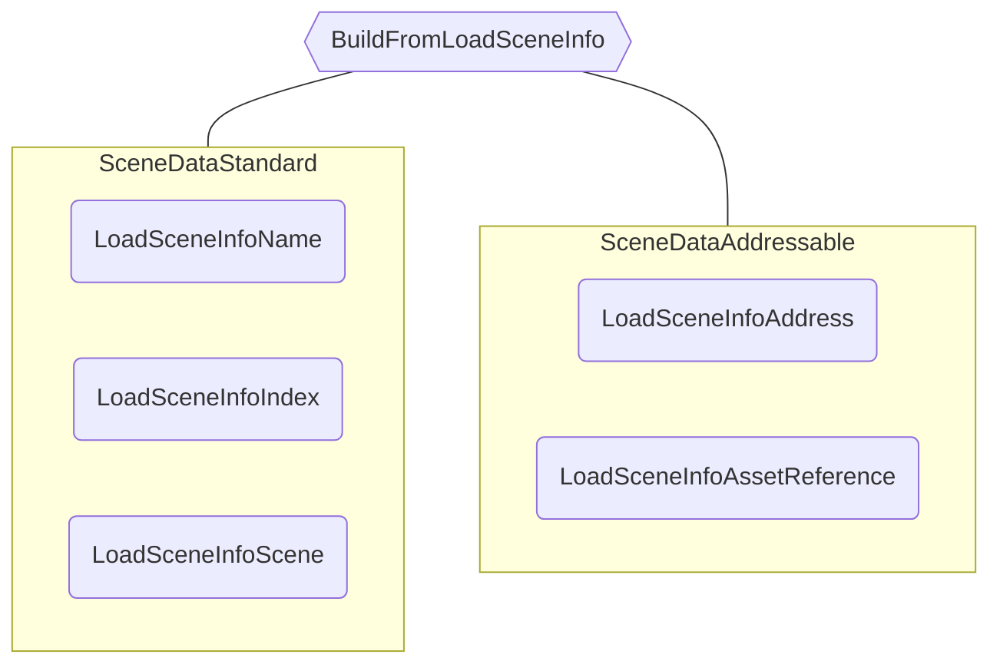

# Scene Data

As implementações de `ISceneData` são usadas internamente pelo Core Scene Manager para vincular uma cena carregada com sua `ILoadSceneInfo` de origem e sua `IAsyncSceneOperation`.
Essas informações são usadas principalmente para lidar corretamente com operações Addressable, mas também são utilizadas no fluxo não-addressable.

## Interface `ISceneData`

A interface `ISceneData` define:

```cs
public interface ISceneData
{
    IAsyncSceneOperation AsyncOperation { get; }
    ILoadSceneInfo LoadSceneInfo { get; }
    Scene SceneReference { get; }

    void SetSceneReferenceManually(Scene scene);

    void UpdateSceneReference();

    bool MatchesLoadSceneInfo(ILoadSceneInfo loadSceneInfo);

    IAsyncSceneOperation LoadSceneAsync();

    IAsyncSceneOperation UnloadSceneAsync();
}
```

Ela mantém uma referência ao `ILoadSceneInfo` usado para carregar a cena, a referência da cena e uma `IAsyncSceneOperation` que pode se referir tanto à operação de carregamento quanto de descarregamento, dependendo do estado da cena.

:::info
Quando as primeiras cenas são adicionadas ao `CoreSceneManager` durante seu construtor, elas são associadas a um `LoadSceneInfoScene` como seu `ILoadSceneInfo`.
:::

Os métodos `SetSceneReferenceManually()` e `UpdateSceneReference()` são usados pelos fluxos não-addressable e addressable, respectivamente.
O primeiro é utilizado para atribuir manualmente qual cena foi carregada pelo fluxo padrão, já que isso não é exposto pelos métodos do `SceneManager` da Unity.
O segundo atualiza a referência da cena com base no resultado da `IAsyncSceneOperation`, já que o fluxo addressable retorna qual cena foi carregada.

Por fim, o `ISceneData` também define os métodos `LoadSceneAsync` e `UnloadSceneAsync`, que internamente chamam as APIs do `SceneManager` ou dos `Addressables`, dependendo de sua implementação.

Existem apenas duas implementações de `ISceneData`: `SceneDataStandard` e `SceneDataAddressable`.

## Criando uma instância de Scene Data

Como o tipo de Scene Data depende do tipo de `ILoadSceneInfo`, ele é criado por meio de uma classe auxiliar: `SceneDataBuilder`.

```cs
public static class SceneDataBuilder
{
    public static ISceneData BuildFromLoadSceneInfo(ILoadSceneInfo sourceLoadSceneInfo);

    public static ISceneData BuildFromScene(Scene scene);
}
```

Construir a partir de `ILoadSceneInfo` gerará:



Construir a partir de uma cena carregada sempre retornará um `LoadSceneInfoScene`, já que é a referência de cena mais confiável.

## Operando com Scene Data

O `CoreSceneManager` opera com Scene Data internamente para armazenar em cache as cenas carregadas e orquestrar as **Operações de Cena**.
Como algumas operações de Scene Data não estão diretamente relacionadas ao `CoreSceneManager`, seu uso é implementado em uma classe utilitária: `SceneDataUtilities`.

```cs
public static class SceneDataUtilities
{
    public static void LinkLoadedScenesWithSceneDataArray(ISceneData[] sceneDataArray, IList<ISceneData> sceneDatasToExclude);

    public static ISceneData[] GetLoadedSceneDatasWithLoadSceneInfos(ILoadSceneInfo[] sourceSceneInfos, IList<ISceneData> loadedSceneDataList);

    public static Scene[] GetScenesFromSceneDataArray(ISceneData[] sceneDataArray);

    public static float GetAverageSceneLoadOperationProgress(ISceneData[] sceneDataArray);

    public static bool TryLinkLoadedSceneWithSceneData(Scene scene, IList<ISceneData> sceneDataList, out ISceneData matchedData);

    public static bool TryGetSceneDataByLoadSceneInfo(ILoadSceneInfo loadSceneInfo, IEnumerable<ISceneData> sceneDataList, out ISceneData sceneData);

    public static bool TryGetSceneDataByLoadedScene(Scene scene, ICollection<ISceneData> sceneDataList, out ISceneData sceneData);

    public static bool HasCompletedAllSceneLoadOperations(ISceneData[] sceneDataArray);
}
```

Você pode usar essa classe e a implementação do `CoreSceneManager` como referência para personalizar seu uso, se necessário.