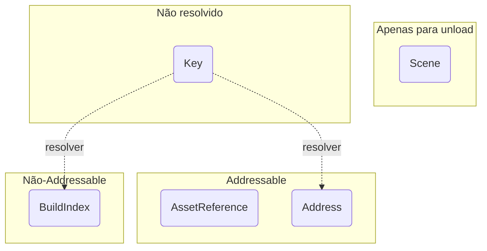

# Scene Ref

O `SceneRef` é uma referência a uma cena — o que você passa para toda operação. Uma única struct cobre todas as formas de nomear uma cena.

## Uma struct para todo tipo de referência {/* #one-struct-for-every-kind-of-reference */}

```cs
public readonly struct SceneRef
{
  public SceneRefKind Kind { get; }
  public bool IsValid { get; }

  public string Key { get; }
  public int BuildIndex { get; }
  public Scene Scene { get; }
}
```

Cada tipo vive no seu próprio campo, com `Kind` dizendo qual deles está definido. É isso que evita que um índice de build sofra boxing para `object` e seja convertido de volta a cada chamada.

Você raramente escreve `SceneRef` por conta própria, porque tudo converte implicitamente:

```cs
SceneRef byName  = "my-scene";                 // Key
SceneRef byIndex = 1;                          // BuildIndex
SceneRef byScene = someLoadedScene;            // Scene
SceneRef address = SceneRef.Address("my-scene");
SceneRef asset   = myAssetReference;           // AssetReference
```

## Tipos de Scene Ref {/* #scene-ref-kinds */}



* `Key` — uma string simples: nome, caminho ou endereço. **Ainda não resolvida**; veja abaixo.
* `BuildIndex` — o índice de build de uma cena.
* `Scene` — a struct de uma cena carregada (usada apenas para descarregar cenas).
* `Address` — um endereço dos Addressables, declarado explicitamente.
* `AssetReference` — o `AssetReference` Addressable de uma cena.
* `None` — não aponta para nada. É o que `default(SceneRef)` representa.

## Como uma string é resolvida {/* #how-a-string-is-resolved */}

Você nunca escolhe entre uma API addressable e uma não-addressable. Uma string simples chega como `Key`, e o `SceneRefResolver` decide o que ela significa:

1. **As Build Settings vencem.** Se a string corresponde a um nome ou caminho de cena nas Build Settings, ela vira um `BuildIndex`.
2. Caso contrário, os Addressables são consultados, e ela vira um `Address`.
3. Se nenhum dos dois a tiver, a resolução lança uma exceção indicando os dois lugares onde procurou.

```cs
MySceneManager.LoadAsync("my-scene");                    // build settings, ou Addressables
MySceneManager.LoadAsync(SceneRef.Address("my-scene"));  // forçado, e o caminho rápido
```

`SceneRef.Address(...)` é a forma de forçar o resultado, e pula a consulta por completo.

:::warning
A resolução é **comportamento observável**, não um detalhe de implementação. Adicionar uma cena às Build Settings mais tarde pode fazer uma string passar dos Addressables para o backend padrão sem nenhuma mudança de código do seu lado.

Uma chave que corresponde a ambos é reportada em `Warning` através do [`SceneManagerLog`](./logging.md), e a primeira resolução de cada chave é reportada em `Verbose`, então isso é diagnosticável, e não um mistério.
:::

:::info
Só uma chave nunca vista antes, e que não está nas Build Settings, precisa do catálogo dos Addressables — e só esse caso suspende a execução. Toda resposta fica em cache, então cada chave é consultada no máximo uma vez, mas a primeira resolução addressable por string paga, sim, a latência de inicialização do catálogo.
:::

## Descarregando {/* #unloading */}

Ao **descarregar** uma cena, o `CoreSceneManager` procura entre suas cenas carregadas qualquer uma que corresponda ao `SceneRef`, seja pelo handle da cena, nome, caminho, build index ou referência addressable.

Isso significa que a forma **preferencial** de descarregar cenas é passando a própria `Scene`, pois ela contém uma **referência direta** ao alvo; ainda assim, você pode usar qualquer tipo.

:::warning
Se você tiver várias cenas idênticas carregadas, descarregar por qualquer coisa que não seja uma `Scene` vai descarregar a última cena carregada que corresponda à referência.
:::

:::info
Ao descarregar cenas addressable, seus recursos serão liberados chamando `Addressables.UnloadSceneAsync` internamente.
:::

## Scene Parameters {/* #scene-parameters */}

`SceneParameters` envolve um ou vários `SceneRef`, além de qual deles deve ficar ativo. Ele também converte implicitamente, então na maior parte do tempo você passa a cena direto para a operação e nunca nomeia a struct:

```cs
MySceneManager.LoadAsync("my-scene");                                  // uma, não ativada
MySceneManager.LoadAsync(new SceneParameters("my-scene", true));       // uma, ativada
MySceneManager.LoadAsync(new[] { "scene-a", "scene-b" });              // várias, nenhuma ativada
MySceneManager.LoadAsync(new SceneParameters(new SceneRef[] { "scene-a", "scene-b" }, 1));
```

:::note
Uma conversão simples nunca define a cena como ativa — você precisa pedir isso explicitamente. A exceção é `TransitionAsync`, que sempre ativa alguma coisa, porque descarrega a cena de onde você veio.
:::
