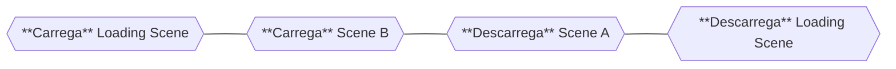

# Transições de Cena

Uma **Transição de Cena** é uma orquestração de operações de **carregamento** e **descarregamento** para efetivamente transicionar entre cenas, com ou sem uma cena intermediária. Por exemplo, se você quiser ir da cena A para a cena B, você poderia:

1. **Carregar** a cena B.
2. **Descarregar** a cena A.


São só **duas** operações, mas se você também quiser uma tela de carregamento, poderia:

1. **Carregar** a cena de carregamento.
2. **Carregar** a cena B.
4. **Descarregar** a cena A.
3. **Descarregar** a cena de carregamento.



Agora são **quatro** operações.
O método `TransitionAsync` permite informar a cena (ou cenas) para a qual você quer transicionar a partir da **cena ativa atual**, e se você quer uma cena intermediária (uma cena de carregamento, por exemplo).

## A tela de carregamento {/* #the-loading-screen */}

O segundo argumento do `TransitionAsync` é uma [`LoadingScreen`](../getting-started/loading-screens.md). Nomear uma cena já te dá uma implicitamente, então o caso comum continua sendo uma linha só:

```cs
MySceneManager.TransitionAsync("target", "loading");        // uma cena, como antes
MySceneManager.TransitionAsync("target", new MyScreen());   // um prefab ou um documento UI Toolkit
```

Quando a tela de carregamento **é** uma cena, o componente `LoadingBehavior` presente nela é notificado do progresso. Qualquer coisa nessa cena que precise que a transição espere — um fade, uma animação, um script — faz uma **retenção** nos portões do seu `LoadingProgress` com `HoldShow` / `HoldHide` e a libera quando terminar, efetivamente **atrasando** a transição para exibir um feedback visual, como um efeito de fade in/out.

## Sabendo onde você está {/* #knowing-where-you-are */}

Ao dar _await_ em `TransitionAsync`, ele espera até que toda a transição tenha sido concluída **e** a tela de carregamento tenha sumido. Se você precisa de um momento específico antes disso, a operação reporta sua fase:

```cs
SceneOperation op = MySceneManager.TransitionAsync("target", "loading");

op.StateChanged += o =>
{
  if (o.State == SceneOperationState.ScreenOut)
    BeginIntroCutscene();       // a tela de carregamento desapareceu por completo
};

await op;
```

Você também pode confiar no próprio `Awake()` da cena alvo, ou se inscrever no evento `SceneLoaded` da operação ou do gerenciador.

:::note
Uma transição **sempre ativa alguma coisa** — ela descarrega a cena de onde você veio, então não pode terminar sem nenhuma cena ativa. Se o seu `SceneParameters` não indicar um índice para ativar, o índice 0 é usado.
:::
