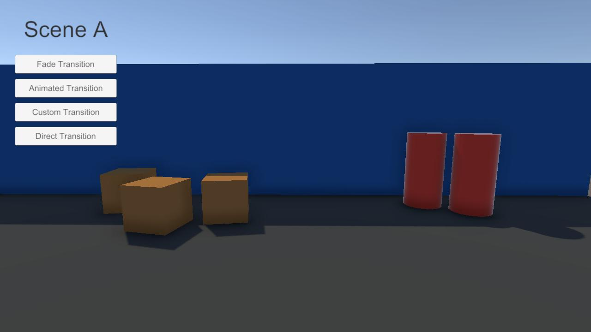

# Exemplos de Cena de Carregamento

Este exemplo demonstra diferentes cenas de carregamento e como usar as **Transições de Cena** com o pacote.

## Instalação

Importe o exemplo através do **Package Manager**.

1. Abra `Window/Package Manager`.
2. Selecione `My Scene Manager` da lista `In Project`.
3. No painel direito, selecione a aba **Samples**.
4. Clique no botão `Import` do item `Loading Scene Examples`.

Os arquivos do exemplo serão instalados em `Samples/My Scene Manager/<version>/Loading Scene Examples`.

## Compatibilidade com Scriptable Render Pipeline

Ao importar o exemplo em um projeto com um **Scriptable Render Pipeline** ativo, uma caixa de diálogo aparecerá perguntando se você deseja atualizar automaticamente os materiais do exemplo.
Isso atualizará os materiais tanto para **URP** quanto para **HDRP**.

## Adicionando cenas às Build Settings

Depois de importar o exemplo, uma caixa de diálogo aparecerá perguntando se você deseja adicionar automaticamente as cenas do exemplo às **Build Settings**.
Isso é necessário para permitir as **Transições de Cena** entre as cenas do exemplo.
Se você ignorar essa mensagem, precisará adicionar as cenas manualmente nas **Build Settings** para testar o exemplo.

Você pode remover facilmente as cenas adicionadas às **Build Settings** pelo menu: `Tools/My Scene Manager/Remove 'Loading Scene Examples' from Build Settings`.

## Testando o Exemplo

O exemplo contém **duas** cenas de jogo e **três** cenas de carregamento:

- **SceneA**
- **SceneB**
- **Loading_Fade**
- **Loading_Animated**
- **Loading_Custom**

Você pode começar abrindo **SceneA** ou **SceneB** e entrando no modo de jogo.

Ao entrar no modo de jogo, você verá **quatro** botões no canto superior esquerdo.
Cada um deles inicia uma transição de cena para a outra cena de jogo, usando diferentes cenas de carregamento:



- **Fade Transition**: efeito de _fade in/out_, barra de progresso e texto de progresso.
- **Animated Transition**: efeito animado de entrada e saída.
- **Custom Transition**: componente de preenchimento de imagem personalizado e texto de progresso.
- **Direct Transition**: sem cena de carregamento.

Experimente as transições para ver os efeitos em tempo real.

## Entendendo as Cenas de Carregamento

Todas as cenas de carregamento possuem o componente `LoadingBehavior` e controlam o progresso de carregamento através dos eventos e métodos de `LoadingBehavior.Progress`.

Para realizar **Transições de Cena** nas cenas de jogo, o exemplo usa um componente simples que aciona as transições ao clicar nos botões:

```cs
public class SceneTransitionTrigger : MonoBehaviour
{
    [SerializeField]
    string _targetScene;

    public void TransitionWithLoading(string loadingScene)
    {
        MySceneManager.TransitionAsync(_targetScene, loadingScene);
    }

    public void Transition()
    {
        MySceneManager.TransitionAsync(_targetScene);
    }
}
```

### Transição de _Fade_

A cena `Loading_Fade` segue o guia [Criando Telas de Carregamento](../getting-started/loading-screens.md).
Ela inclui o componente `LoadingFader`, além dos componentes `LoadingFeedbackText` e `LoadingFeedbackSlider` para exibir o progresso.

### Transição Animada

A cena `Loading_Animated` implementa uma animação personalizada com um componente `Animator` e um script personalizado.
O script se inscreve no evento `LoadingProgress.LoadingCompleted` do `LoadingBehavior.Progress` e executa animações no `Animator`.

```cs
public class AnimatedTrigger : MonoBehaviour
{
    static readonly int _isOpenHash = Animator.StringToHash("IsOpen");

    [SerializeField]
    LoadingBehavior _loadingBehavior;

    LoadingProgress _loadingProgress;
    Animator _animator;

    void Awake()
    {
        _animator = GetComponent<Animator>();

        _loadingProgress = _loadingBehavior.Progress;
        _loadingProgress.LoadingCompleted += PlayOutAnimation;

        PlayInAnimation();
    }

    public void InTransitionTrigger()
    {
        _loadingProgress.StartTransition();
    }

    public void OutTransitionTrigger()
    {
        _loadingProgress.EndTransition();
    }

    void PlayInAnimation()
    {
        _animator.SetBool(_isOpenHash, false);
    }

    void PlayOutAnimation()
    {
        _animator.SetBool(_isOpenHash, true);
    }
}
```

Os métodos `InTransitionTrigger` e `OutTransitionTrigger` são chamados através de **Eventos de Animação**.

:::info
A animação **"In"** é executada após a cena de carregamento ser carregada e antes das cenas de destino começarem a carregar.
A animação **"Out"** é executada após as cenas de destino serem carregadas, mas antes da cena de carregamento ser descarregada.
:::

### Transição Personalizada

A cena `Loading_Custom` demonstra como implementar seu próprio componente de feedback de progresso.

```cs
public class LoadingFeedbackImageFill : MonoBehaviour
{
    [SerializeField]
    LoadingBehavior _loadingBehavior;

    Image _image;

    void Awake()
    {
        _image = GetComponent<Image>();
        _image.fillAmount = 0;
    }

    void Start()
    {
        _loadingBehavior.Progress.Progressed += UpdateSlider;
    }

    void UpdateSlider(float progress) => _image.fillAmount = progress;
}
```

Ela se inscreve no evento `LoadingProgress.Progressed` para ser notificada das mudanças no progresso e usa o valor _float_ para atualizar o preenchimento da imagem.

## Conclusão

Com este exemplo, você pôde explorar várias formas de personalizar os componentes existentes do pacote para realizar **Transições de Cena** usando diferentes efeitos de carregamento e feedbacks de progresso.
Use as cenas de exemplo como ponto de partida para criar suas próprias experiências de carregamento ✨.