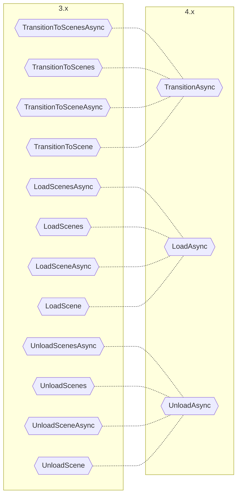

# Atualizando da versão 3.x para 4.x

A atualização `4.x` consolida as mudanças da versão `3.x` e simplifica ainda mais a experiência de uso.
Ela remove completamente as implementações de `ISceneLoader` e adiciona a classe estática `AdvancedSceneManager`, eliminando a necessidade de controlar manualmente seu ciclo de vida.

## Principais mudanças

* Alterada a `AdvancedSceneManager` para ser uma classe estática que gerencia automaticamente seu ciclo de vida. ([#49](https://github.com/mygamedevtools/scene-loader/issues/49))
* A antiga `AdvancedSceneManager` foi convertida em uma nova classe `CoreSceneManager`, usada internamente pela nova `AdvancedSceneManager` estática. ([#49](https://github.com/mygamedevtools/scene-loader/issues/49))
* Adicionados métodos de extensão para evitar a criação manual de instâncias de `ILoadSceneInfo`. ([#49](https://github.com/mygamedevtools/scene-loader/issues/49))
* Removida a interface `ISceneLoader` e todas as suas implementações: `SceneLoaderAsync`, `SceneLoaderCoroutine` e `SceneLoaderUniTask`. ([#39](https://github.com/mygamedevtools/scene-loader/issues/39))
* A lógica de `Transition` foi movida para a interface `ISceneManager` diretamente.
* Unificados os métodos de cena única e múltipla através da nova struct `SceneParameter`.
* Todos os tipos de retorno foram convertidos para `Task<SceneResult>`, que pode retornar uma ou várias cenas, ser aguardado com _await_ e usado em coroutines com `WaitTask`. ([#49](https://github.com/mygamedevtools/scene-loader/issues/49))
* Removidas todas as referências ao [UniTask], mas a compatibilidade foi mantida.
* Melhorada a correspondência de cenas ao descarregá-las. ([#44](https://github.com/mygamedevtools/scene-loader/issues/44))([#48](https://github.com/mygamedevtools/scene-loader/issues/48))
* Adicionado o Exemplo '[Loading Scene Examples](../samples/loading-scene-examples.md)'. ([#36](https://github.com/mygamedevtools/scene-loader/issues/36))

## Atualizações de código

Com a classe estática `AdvancedSceneManager`, não há mais necessidade de gerenciar o ciclo de vida de um `ISceneManager`.
Além disso, não é mais necessário criar instâncias de `ILoadSceneInfo` manualmente, graças aos métodos de extensão.
Considere este código da versão `3.x`:

```cs
ISceneManager manager = new SceneManager();
ISceneLoader loader = new SceneLoaderAsync(manager);

loader.TransitionToSceneAsync(new LoadSceneInfo("my-target-scene"), new LoadSceneInfoName("my-loading-scene"));
```

Ele pode ser convertido para este código da versão `4.x`:

```cs
AdvancedSceneManager.TransitionAsync("my-target-scene", "my-loading-scene");
```

## Fim do `ISceneLoader`

O `ISceneLoader` era uma camada acima do `ISceneManager` que adicionava **Transições de Cena**, mas com o custo de uma estrutura extra.
Agora, as **Transições de Cena** foram movidas diretamente para o `ISceneManager`, eliminando a camada adicional.
Além disso, os métodos agora suportam cenas únicas ou múltiplas e são todos assíncronos.

Atualize suas chamadas conforme o gráfico:



## Mudanças no Scene Manager

A interface `ISceneManager` foi simplificada e recebeu a implementação do método `TransitionAsync`:

```diff
+Task<SceneResult> TransitionAsync(SceneParameters sceneParameters, ILoadSceneInfo intermediateSceneReference = default, CancellationToken token = default);

-ValueTask<Scene[]> LoadScenesAsync(ILoadSceneInfo[] sceneInfos, int setIndexActive = -1, IProgress<float> progress = null, CancellationToken token = default);
-ValueTask<Scene> LoadSceneAsync(ILoadSceneInfo sceneInfo, bool setActive = false, IProgress<float> progress = null, CancellationToken token = default);
+Task<SceneResult> LoadAsync(SceneParameters sceneParameters, IProgress<float> progress = null, CancellationToken token = default);

-ValueTask<Scene[]> UnloadScenesAsync(ILoadSceneInfo[] sceneInfos, CancellationToken token = default);
-ValueTask<Scene> UnloadSceneAsync(ILoadSceneInfo sceneInfo, CancellationToken token = default);
+Task<SceneResult> UnloadAsync(SceneParameters sceneParameters, CancellationToken token = default);
```

Agora, em vez de `ValueTask<Scene>` e `ValueTask<Scene[]>`, o retorno será `Task<SceneResult>`, onde `SceneResult` é uma struct simples que armazena uma ou várias cenas.
Você pode obter as cenas chamando `SceneResult.GetScenes()`.

## Mudanças no Advanced Scene Manager

A antiga `AdvancedSceneManager`, que implementava `ISceneManager`, foi renomeada para `CoreSceneManager`, enquanto a nova `AdvancedSceneManager` agora é uma classe estática que gerencia internamente uma instância de `CoreSceneManager`.

Na prática, a `AdvancedSceneManager` engloba uma instância de `CoreSceneManager` estaticamente.

A implementação de **Transição de Cena** que estava no antigo `SceneLoaderAsync` foi migrada para a `CoreSceneManager`, com algumas melhorias.

## Métodos de Extensão

Com os métodos de extensão, não é mais necessário criar instâncias de `ILoadSceneInfo` manualmente:

```cs
AdvancedSceneManager.TransitionAsync("my-target-scene", "my-loading-scene");
```

Isso funciona tanto para a `AdvancedSceneManager` estática quanto para qualquer implementação de `ISceneManager`.
Os métodos de extensão usam os argumentos para construir um `SceneParameter` internamente, como:

```cs
public static Task<SceneResult> TransitionAsync(this ISceneManager sceneManager, string targetSceneName, string loadingSceneName = null, CancellationToken token = default)
{
  SceneParameters targetParams = new(new LoadSceneInfoName(targetSceneName), true);
  ILoadSceneInfo loadingSceneInfo = string.IsNullOrWhiteSpace(loadingSceneName) ? null : new LoadSceneInfoName(loadingSceneName);
  return sceneManager.TransitionAsync(targetParams, loadingSceneInfo, token);
}
```

Como carregar as cenas por nome/caminho e pelo endereço addressable compartilha a mesma assinatura, os métodos de extensão addressable tem o sufixo Addressable, por exemplo:

```cs
public static Task<SceneResult> TransitionAddressableAsync(this ISceneManager sceneManager, string targetAddress, string loadingAddress = null, CancellationToken token = default);
```

## Coroutines

Com a remoção do `SceneLoaderCoroutine` e a conversão do tipo de retorno para `Task<SceneResult>`, você ainda pode aguardar por esses métodos em coroutines.
Você só precisa converter a task para uma `WaitTask`, que pode ser aguardada:

```cs
yield return AdvancedSceneManager.TransitionAsync("my-target-scene", "my-loading-scene").ToWaitTask();
```

Você pode usar a `WaitTask` para ler a cena carregada:

```cs
WaitTask<SceneResult> waitTask = AdvancedSceneManager.LoadAsync("my-target-scene");
yield return waitTask;

Scene loadedScene = waitTask.Task.Result.GetScene();
```

## UniTask

As referências ao pacote [UniTask] foram removidas junto com o `SceneLoaderUniTask`, mas como ele suporta fluxos padrões de async/await, você ainda pode usar [UniTask] com o pacote.

## Atualizações no Descarregamento de Cenas

Na versão `3.x` você só podia descarregar uma cena por meio de um `LoadSceneInfoScene` que contém uma referência direta à cena, ou pelo mesmo `ILoadSceneInfo` que carregou a cena.

Agora, você pode usar **qualquer** referência válida para descarregar uma cena: nome, caminho, índice de build, cena, endereço addressable ou `AssetReference`.

Cenas addressable também podem ser descarregadas por qualquer referência válida exceto pelo seu índice de build, que é sempre `-1`. Para descarregar por uma referência addressable, ela deve ser igual ao `ILoadSceneInfo` usado para carregar a cena: `LoadSceneInfoAddress` ou `LoadSceneInfoAssetReference`.

## Conclusão

A versão `4.x` conclui as iniciativas de simplificação iniciadas na versão `3.x` e aproxima a usabilidade do Unity Scene Manager, ao mesmo tempo que entrega melhorias poderosas.
Esperamos que essas mudanças melhorem a experiência para novos e antigos usuários.

[UniTask]: https://github.com/Cysharp/UniTask