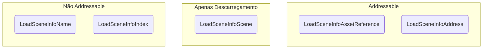

# Load Scene Info

O **Load Scene Info** é um objeto que guarda uma referência a uma cena para ser carregada (ou descarregada) e valida se ele _pode_ ser referência a uma cena carregada.

## Interface `ILoadSceneInfo`

A interface `ILoadSceneInfo` apenas define:

```cs
public interface ILoadSceneInfo
{
  LoadSceneInfoType Type { get; }

  object Reference { get; }

  bool CanBeReferenceToScene(Scene scene);
}
```

Já que o campo `Reference` pode guardar qualquer tipo de referência, o scene manager será responsável por decidir o que fazer com esse valor.
O `LoadSceneInfoType` é basicamente um enum que ajuda a converter o valor de `Reference` sem precisar converter o objeto `ILoadSceneInfo`.
O load scene info apenas guarda essas informações, e por isso que suas implementações inclusas no pacote são todas **readonly structs**.

## Tipos de Load Scene Info

Você pode escolher trabalhar com **cinco** load scene infos:



* O `LoadSceneInfoName`, referenciando o nome de uma cena.
* O `LoadSceneInfoIndex`, referenciando o índice de build de uma cena.
* O `LoadSceneInfoScene`, referenciando a `struct` de uma cena carregada.
* O `LoadSceneInfoAssetReference`, referenciando o Addressable Asset Reference de uma cena.
* O `LoadSceneInfoAddress`, referenciando o Addressable Address de uma cena.

Você também pode definir sua própria implementação de `ILoadSceneInfo` se você tiver necessidades específicas, mas isso provavlmente requerá que você implementa um scene manager para interpretar seu valor de `Reference` também.

Ao **descarregar** uma cena, o `AdvancedSceneManager` irá procurar por qualquer uma das suas cenas carregadas (em ordem de prioridade):
1. Tem o mesmo scene handle de uma cena carregada (no caso do `LoadSceneInfoScene`).
2. Tem o mesmo `ILoadSceneInfo`.

Isso significa que a forma **preferida** de descarregar cenas é usando um `LoadSceneInfoScene`, já que ele carrega uma **referência direta** à cena alvo.
Assumindo que você não tem várias cenas carregadas com a mesma referência, é seguro afirmar que a cena que você quer descarregar é a que tem o mesmo `ILoadSceneInfo` que você providenciou.
Exceto ao `LoadSceneInfoScene`, você **não pode** descarregar uma cena com um tipo `ILoadSceneInfo` diferente.

:::warning
Se você tem várias cenas carregadas com a mesma referência, descarregando pelo `ILoadSceneInfo` sempre irá descarregar a última cena carregada com essa referência.
:::

:::info
Ao descarregar cenas addressable, seus recursos são descarregados por meio de uma chamada interna ao método `Addressables.UnloadSceneAsync`.
:::