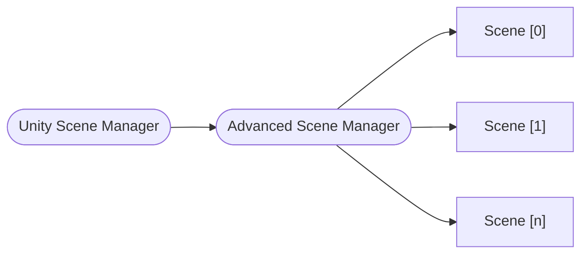

# O Scene Manager

O **Scene Manager** é a peça mais importante do pacote.
Ele é responsável por realizar as operações de cena em coordenação com o **Unity Scene Manager**.

## Interface `ISceneManager`

A interface `ISceneManager` expõe alguns métodos e eventos para padronizar as operaçòes de carregamento de cenas:

```cs
public interface ISceneManager : IDisposable
{
  event Action<Scene, Scene> ActiveSceneChanged;
  event Action<Scene> SceneUnloaded;
  event Action<Scene> SceneLoaded;

  int LoadedSceneCount { get; }
  int TotalSceneCount { get; }

  void SetActiveScene(Scene scene);

  ValueTask<Scene[]> LoadScenesAsync(ILoadSceneInfo[] sceneInfos, int setIndexActive = -1, IProgress<float> progress = null, CancellationToken token = default);

  ValueTask<Scene> LoadSceneAsync(ILoadSceneInfo sceneInfo, bool setActive = false, IProgress<float> progress = null, CancellationToken token = default);

  ValueTask<Scene[]> UnloadSceneAsync(ILoadSceneInfo[] sceneInfos, CancellationToken token = default);

  ValueTask<Scene> UnloadSceneAsync(ILoadSceneInfo sceneInfo, CancellationToken token = default);

  Scene GetActiveScene();

  Scene GetLoadedSceneAt(int index);

  Scene GetLastLoadedScene();

  Scene GetLoadedSceneByName(string name);
}
```

Você pode encontrar várias semelhanças entre a classe [SceneManager](https://docs.unity3d.com/ScriptReference/SceneManagement.SceneManager.html) do Unity, e isso serve tanto para manter uma curva de aprendizagem fácil tanto porque essas operações vão acabar chamando o _Unity Scene Manager_ internamente (como `SetActiveScene` por exemplo).
A interface `ILoadSceneInfo` será abordada na próxima seção.

O pacote inclui o `AdvancedSceneManager`, capaz de tratar tanto operações de cenas **addressable** como **não addressable**. Você pode usar sua implementação como referência para **criar seu próprio** Scene Manager se for preciso.

Espera-se que o `AdvancedSceneManager` seja usado como uma camada acima do `SceneManager` do Unity. Ao criar um `AdvancedSceneManager` você poderá decidir se gostará de gerenciar cenas que já foram carregadas.



A interface `ISceneManager` define que tanto o método `LoadSceneAsync` quanto `UnloadSceneAsync` retornem uma `ValueTask<Scene>`.
Isso significa que você pode usar _await_ para todos esses métodos se partir de uma implementação _async_, ou você pode se inscrever nos eventos `SceneLoaded` ou `SceneUnloaded` para receber a mesma `Scene` que você receberia por meio de métodos _async_.

Ambos os métodos também recebem um objeto `ILoadSceneInfo`.
Então, ao invés de ter vários métodos recebendo o índice de build da cena ou seu nome, nós simplesmente temos um objeto.

Além disso, você também pode usar os métodos `LoadScenesAsync` e `UnloadScenesAsync` para realizar operações em várias cenas em paralelo. Eles retornarão uma `ValueTask<Scene[]>`.

Você pode criar um `AdvancedSceneManager` usando três construtores:

```cs
// Cria um advanced scene manager incluindo todas as cenas já carregadas. Útil para a maioria dos casos.
// Não deve ser chamado no `Awake()`, porque ele é executado antes da cena ser carregada.
new AdvancedSceneManager(addLoadedScenes: true);

// Cria um advanced scene manager vazio. Útil se você estiver fazendo isso antes que qualquer cena seja carregada, ou em uma cena de inicialização.
new AdvancedSceneManager();

// Cria um advanced scene manager incluindo um array de cenas. Útil quando você quer incluir apenas um grupo específico de cenas.
new AdvancedSceneManager(initializationScenes: new Scene[]);
```