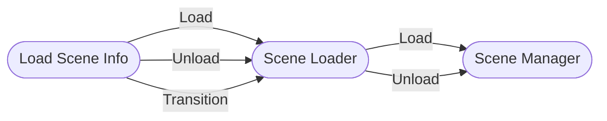

# Guia Básico

Carregar cenas com esse pacote implica que as cenas **sempre serão carregadas aditivamente**. Isso porque não há vantagem em carregar cenas no modo **Single** quando você espera trabalhar com múltiplas cenas.

Para padronizar como as cenas são carregadas, você usará objetos `ISceneLoader`, `ISceneManager` e `ILoadSceneInfo`.



Essas estruturas devem ser usadas juntas. Se você não planeja usar transições de cenas, ou se tem tipos próprios _awaitable_, você pode usar o `ISceneManager` diretamente sem um `ISceneLoader`.

## Criando seu scene loader

Para o primeiro exemplo, vamos construir um **Scene Manager** e um **Coroutine Scene Loader**:

```cs
using MyGameDevTools.SceneLoading;
// [...]

ISceneManager sceneManager = new AdvancedSceneManager();
ISceneLoader sceneLoader = new SceneLoaderCoroutine(sceneManager);
```

Você também pode construir um **Async Scene Loader**:

```cs
ISceneManager sceneManager = new SceneManager();

ISceneLoaderCoroutine coroutineSceneLoader = new SceneLoaderCoroutine(sceneManager);
// Ou
ISceneLoaderAsync asyncSceneLoader = new SceneLoaderAsync(sceneManager);
// Ou
ISceneLoaderUniTask unitaskSceneLoader = new SceneLoaderUniTask(sceneManager);
```

:::note
É recomendado que você guarde referências a esses objetos como **interfaces** para reduzir o acoplamento no seu código.
:::

## Carregando cenas com `ILoadSceneInfo`

Você usará objetos **LoadSceneInfo** para referenciar tanto cenas addressable como não addressable.

Vamos considerar que você incluiu as seguintes cenas em **Build Settings**:

0. Main Menu
1. Loading

E você tem as seguintes cenas em **grupos addressable**:

* Shop
* Level 1

Você pode carregar as cenas usando os `ILoadSceneInfo` apropriados:

```cs
ILoadSceneInfo mainMenuSceneInfo = new LoadSceneInfoName("Main Menu");
ILoadSceneInfo loadingSceneInfo = new LoadSceneInfoIndex(1);
ILoadSceneInfo shopSceneInfo = new LoadSceneInfoAddress("Shop");
// Você deve poder pegar o Asset Reference de uma cena pelo inspector expondo um
// AssetReference em um MonoBehaviour ou ScriptableObject
ILoadSceneInfo levelSceneInfo = new LoadSceneInfoAssetReference(levelSceneAssetReference);

// Carregar a cena chama o mesmo método, independente do tipo de load scene info
sceneLoader.LoadScene(mainMenuSceneInfo);

// Ou a alternativa async
await sceneLoader.LoadSceneAsync(mainMenuSceneInfo);
```

## Descarregando cenas

Você pode usar todos os tipos de `ILoadSceneInfo` da operação de carregamento com a adição do `LoadSceneInfoScene`, para carregar cenas não addressable utilizando a cena retornada do `ISceneLoaderAsync.LoadSceneAsync`.

```cs
Scene levelScene = await sceneLoader.LoadSceneAsync(new LoadSceneInfoAssetReference(levelSceneAssetReference));
ILoadSceneInfo levelSceneInfo = new LoadSceneInfoScene(levelScene);

// [...]
sceneLoader.UnloadScene(levelSceneInfo);

// Alternativa async
await sceneLoader.UnloadSceneAsync(levelSceneInfo);
```

Ao invés de usar o método async, você também pode se inscrever no evento `ISceneManager.SceneLoaded`:

```cs
sceneLoader.Manager.SceneLoaded += loadedScene => 
{
  ILoadSceneInfo loadedSceneInfo = new LoadSceneInfoScene(loadedScene);
  sceneLoader.UnloadScene(loadedSceneInfo);
}
```

## Transições de Cenas

Você pode combinar objetos diferentes de **Load Scene Info** no método de transição:

```cs
ILoadSceneInfo stageSceneInfo = new LoadSceneInfoName("Stage 1");
ILoadSceneInfo loadingSceneInfo = new LoadSceneInfoIndex(1);

sceneLoader.TransitionToScene(stageSceneInfo, loadingSceneInfo);

// Ou a alternativa async
await sceneLoader.TransitionToSceneAsync(stageSceneInfo, loadingSceneInfo);
```