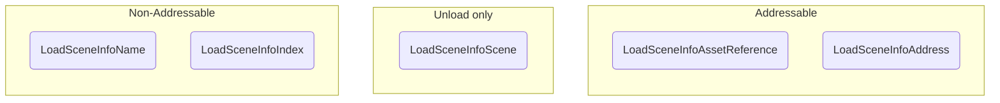

# Load Scene Info

The **Load Scene Info** is an object that holds a reference to a scene to be loaded (or unloaded) and validates whether it _can_ reference a loaded scene.

## `ILoadSceneInfo` interface

The `ILoadSceneInfo` interface simply defines:

```cs
public interface ILoadSceneInfo
{
  LoadSceneInfoType Type { get; }

  object Reference { get; }

  bool CanBeReferenceToScene(Scene scene);
}
```

Since the `Reference` field can hold any type of reference, the scene manager will be responsible for deciding what to do with its value.
The `LoadSceneInfoType` is a simple enum that helps converting the `Reference` value without casting the `ILoadSceneInfo` object.
The load scene info simply holds these references, and that's why the implementations included with the package are all **readonly structs**.

## Load Scene Info Types

You can choose to work with **five** load scene infos:



* The `LoadSceneInfoName`, referencing a scene's name.
* The `LoadSceneInfoIndex`, referencing a scene's build index.
* The `LoadSceneInfoScene`, referencing a loaded scene's struct (used for unloading scenes only).
* The `LoadSceneInfoAssetReference`, referencing a scene's Addressable Asset Reference.
* The `LoadSceneInfoAddress`, referencing a scene's Addressable Address.

You can also build your own `ILoadSceneInfo` implementation if have special needs, but that will probably require you to build a scene manager to interpret its `Reference` value as well.

When **unloading** a scene, the `AdvancedSceneManager` will look for any of its loaded scenes that (in order of priority):
1. Have the same loaded scene handle (in the case of `LoadSceneInfoScene`).
2. Have the same `ILoadSceneInfo`.

That means that the **preferable** way to unload scenes is through `LoadSceneInfoScene`, as it holds a **direct reference** to the target scene.
Assuming you don't have multiple scenes loaded with the same reference, it's safe to assume that the scene you want to unload is the one with the same `ILoadSceneInfo` you provided.
Except from `LoadSceneInfoScene`, you **cannot** unload a scene with a different `ILoadSceneInfo` type.

:::warning
If you do have multiple scenes loaded by the same reference, unloading by its `ILoadSceneInfo` will unload the last loaded scene of that reference.
:::

:::info
When unloading addressable scenes, their resources will be released by calling `Addressables.UnloadSceneAsync` internally.
:::