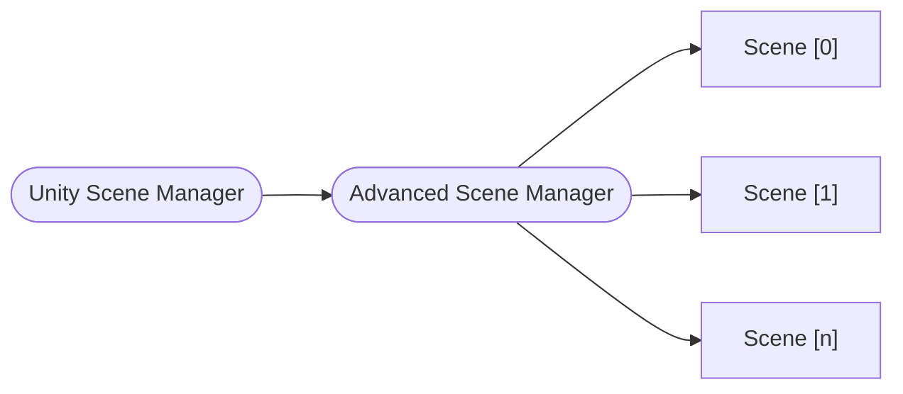

# The Scene Manager

The **Scene Manager** is the most important piece of the package.
It is responsible for performing the scene operations in coordination with the **Unity Scene Manager**.

## `ISceneManager` interface

The `ISceneManager` interface exposes a few methods and events to standardize the scene load operations:

```cs
public interface ISceneManager : IDisposable
{
  event Action<Scene, Scene> ActiveSceneChanged;
  event Action<Scene> SceneUnloaded;
  event Action<Scene> SceneLoaded;

  int LoadedSceneCount { get; }
  int TotalSceneCount { get; }

  void SetActiveScene(Scene scene);

  ValueTask<Scene[]> LoadScenesAsync(ILoadSceneInfo[] sceneInfos, int setIndexActive = -1, IProgress<float> progress = null, CancellationToken token = default);

  ValueTask<Scene> LoadSceneAsync(ILoadSceneInfo sceneInfo, bool setActive = false, IProgress<float> progress = null, CancellationToken token = default);

  ValueTask<Scene[]> UnloadSceneAsync(ILoadSceneInfo[] sceneInfos, CancellationToken token = default);

  ValueTask<Scene> UnloadSceneAsync(ILoadSceneInfo sceneInfo, CancellationToken token = default);

  Scene GetActiveScene();

  Scene GetLoadedSceneAt(int index);

  Scene GetLastLoadedScene();

  Scene GetLoadedSceneByName(string name);
}
```

You can find many similarities between Unity's [SceneManager](https://docs.unity3d.com/ScriptReference/SceneManagement.SceneManager.html) class, and that's both for maintaining an easy learning curve as well as because some of these operations will end up calling the _Unity Scene Manager_ internally (like `SetActiveScene` for instance).
The `ILoadSceneInfo` interface will be covered in the next section.

The package includes the `AdvancedSceneManager` that is capable of handling both **addressable** and **non-addressable** scene operations. You can use its implementation as a reference to **build your own** Scene Manager if you need.

The `AdvancedSceneManager` is expected to be used as a wrapper for the Unity `SceneManager`. When creating an `AdvancedSceneManager` you can decide whether you want it to manage scenes that have been loaded already or not.



The `ISceneManager` interface defines that both `LoadSceneAsync` and `UnloadSceneAsync` methods return a `ValueTask<Scene>`.
This means you can _await_ those methods if they are implemented with the _async_ keyword, or you can also subscribe to the `SceneLoaded` or `SceneUnloaded` events to receive the same `Scene` you would via the _async_ methods.

Both these methods also receive an `ILoadSceneInfo` object.
So, instead of having multiple methods for receiving the scene's build index or the scene's name, we simply have an object.

Alternatively, you can also use the `LoadScenesAsync` and `UnloadScenesAsync` methods, to perform the operations on multiple scenes in parallel. These will return a `ValueTask<Scene[]>`.

You can create an `AdvancedSceneManager` using three constructors:

```cs
// Creates an advanced scene manager including all currently loaded scenes. Useful for most cases.
// Should not be called on `Awake()`, since it runs before the scene is loaded.
new AdvancedSceneManager(addLoadedScenes: true);

// Creates an empty advanced scene manager. Useful if you are doing this before any scene loads or in a bootstrap scene.
new AdvancedSceneManager();

// Creates an advanced scene manager including an array of scenes. Useful when you want to include only a specific set of scenes to it.
new AdvancedSceneManager(initializationScenes: new Scene[]);
```