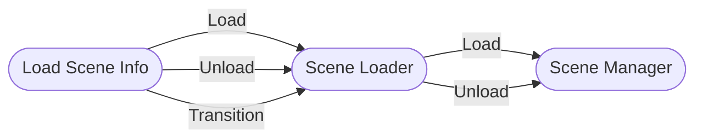

# Basic Usage

Loading scenes with this package implies that the scenes **will always be loaded as Additive**. That is simply because there is no advantage in loading scenes in the **Single** load scene mode when you expect to work with multiple scenes. 

To standardize how the scenes are loaded, you'll be using `ISceneLoader`, `ISceneManager`, and `ILoadSceneInfo` objects.



These structures are meant to be used together. If you do not plan to use scene transitions or to have custom _awaitable_ types, you can use the `ISceneManager` directly without an `ISceneLoader`.

## Creating your scene loader

For the first example, let's build a **Scene Manager** and a **Coroutine Scene Loader**:

```cs
using MyGameDevTools.SceneLoading;
// [...]

ISceneManager sceneManager = new AdvancedSceneManager();
ISceneLoader sceneLoader = new SceneLoaderCoroutine(sceneManager);
```

You can also build an **Async Scene Loader**:

```cs
ISceneManager sceneManager = new SceneManager();

ISceneLoaderCoroutine coroutineSceneLoader = new SceneLoaderCoroutine(sceneManager);
// Or
ISceneLoaderAsync asyncSceneLoader = new SceneLoaderAsync(sceneManager);
// Or
ISceneLoaderUniTask unitaskSceneLoader = new SceneLoaderUniTask(sceneManager);
```

:::note
It is recommended that you store these object references as **interfaces** to reduce coupling in your code.
:::

## Loading scenes with `ILoadSceneInfo`

You'll use the **Load Scene Info** objects to reference both addressable and non-addressable scenes.

Let's assume you have included the following scenes in your **Build Settings**:

0. Main Menu
1. Loading

And you have the following scenes in **addressable groups**:

* Shop
* Level 1

You can load the scenes by using the appropriate `ILoadSceneInfo`:

```cs
ILoadSceneInfo mainMenuSceneInfo = new LoadSceneInfoName("Main Menu");
ILoadSceneInfo loadingSceneInfo = new LoadSceneInfoIndex(1);
ILoadSceneInfo shopSceneInfo = new LoadSceneInfoAddress("Shop");
// You should be able to get the scene's Asset Reference from the inspector by exposing an
// AssetReference on a MonoBehaviour or ScriptableObject.
ILoadSceneInfo levelSceneInfo = new LoadSceneInfoAssetReference(levelSceneAssetReference);

// Loading the scene calls the same method, regardless of the load scene info type
sceneLoader.LoadScene(mainMenuSceneInfo);

// Or the async alternatives
await sceneLoader.LoadSceneAsync(mainMenuSceneInfo);
```

## Unloading scenes

You can use all the `ILoadSceneInfo` types from the load operation with the addition of the `LoadSceneInfoScene`, to unload non-addressable scenes using the scene returned from `ISceneLoaderAsync.LoadSceneAsync`.

```cs
Scene levelScene = await sceneLoader.LoadSceneAsync(new LoadSceneInfoAssetReference(levelSceneAssetReference));
ILoadSceneInfo levelSceneInfo = new LoadSceneInfoScene(levelScene);

// [...]
sceneLoader.UnloadScene(levelSceneInfo);

// Async alternative
await sceneLoader.UnloadSceneAsync(levelSceneInfo);
```

Instead of using the async method, you can also register to the `ISceneManager.SceneLoaded` event:

```cs
sceneLoader.Manager.SceneLoaded += loadedScene => 
{
  ILoadSceneInfo loadedSceneInfo = new LoadSceneInfoScene(loadedScene);
  sceneLoader.UnloadScene(loadedSceneInfo);
}
```

## Scene Transitions

You can combine different **Load Scene Info** objects on the transition method:

```cs
ILoadSceneInfo stageSceneInfo = new LoadSceneInfoName("Stage 1");
ILoadSceneInfo loadingSceneInfo = new LoadSceneInfoIndex(1);

sceneLoader.TransitionToScene(stageSceneInfo, loadingSceneInfo);

// Or the async alternative
await sceneLoader.TransitionToSceneAsync(stageSceneInfo, loadingSceneInfo);
```